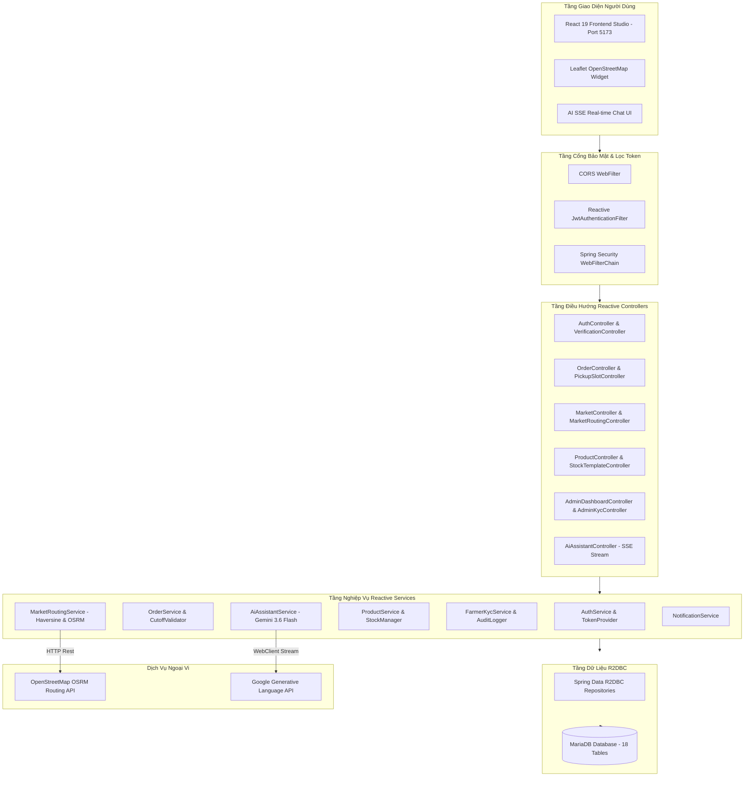
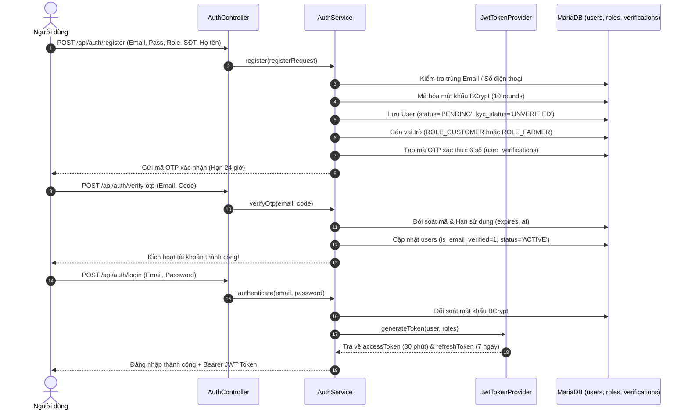
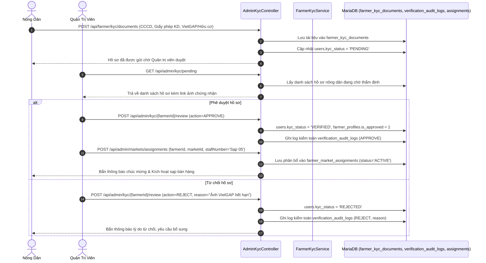
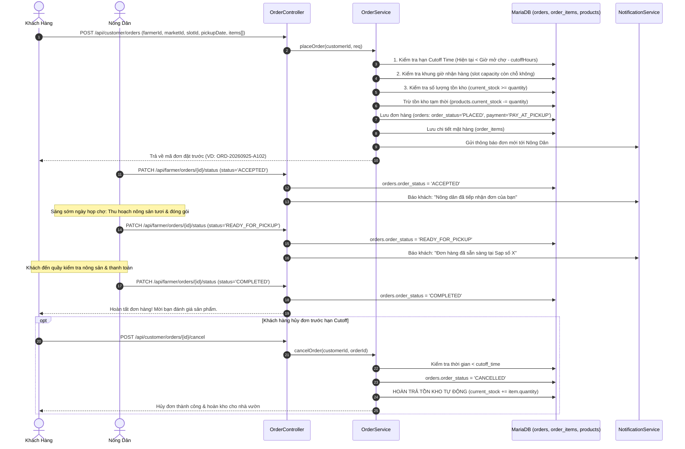
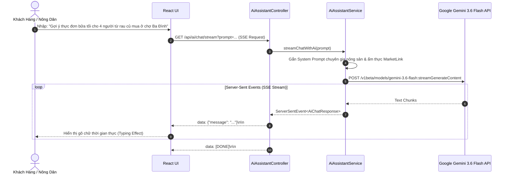
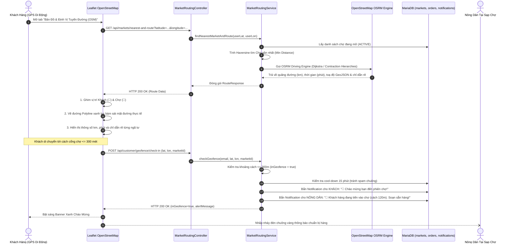

# TÀI LIỆU ĐẶC TẢ TOÀN DIỆN LUỒNG HOẠT ĐỘNG & HƯỚNG DẪN CÀI ĐẶT DỰ ÁN MARKETLINK
> **Nền Tảng Thương Mại Điện Tử Nông Sản Sạch & Kết Nối Phiên Chợ Tương Tác (Farmers Market Pre-Order Platform)**  
> **Đơn vị phát triển:** Gravity Team • **Cuộc thi:** Techwiz 7  
> **Phiên bản tài liệu:** 2.0.0 (Bao gồm OpenStreetMap Routing & Geofencing GPS)  
> **Ngày hoàn thiện:** Tháng 9/2026

---

## MỤC LỤC TỔNG HỢP

1. [HƯỚNG DẪN CÀI ĐẶT & THIẾT LẬP MÔI TRƯỜNG TOÀN DIỆN](#1-hướng-dẫn-cài-đặt--thiết-lập-môi-trường-toàn-diện)
   - 1.1. Yêu cầu phần mềm tiên quyết (Prerequisites)
   - 1.2. Hướng dẫn thiết lập Cơ sở dữ liệu MariaDB / MySQL
   - 1.3. Cấu hình biến môi trường & API Key
   - 1.4. Cài đặt các thư viện Frontend bổ sung
   - 1.5. Lệnh khởi chạy toàn bộ hệ thống
2. [TỔNG QUAN HỆ THỐNG & BÀI TOÁN GIẢI QUYẾT](#2-tổng-quan-hệ-thống--bài-toán-giải-quyết)
3. [KIẾN TRÚC KỸ THUẬT & CÔNG NGHỆ (TECH STACK)](#3-kiến-trúc-kỹ-thuật--công-nghệ-tech-stack)
4. [SƠ ĐỒ KIẾN TRÚC PHÂN TẦNG HỆ THỐNG](#4-sơ-đồ-kiến-trúc-phân-tầng-hệ-thống)
5. [CÁC VAI TRÒ & PHÂN QUYỀN TRUY CẬP (RBAC)](#5-các-vai-trò--phân-quyền-truy-cập-rbac)
6. [CHI TIẾT 10 LUỒNG HOẠT ĐỘNG CHÍNH CỦA DỰ ÁN](#6-chi-tiết-10-luồng-hoạt-động-chính-của-dự-án)
   - [Luồng 1: Xác Thực, Đăng Ký, OTP & Quản Lý Phiên (Auth & RBAC)](#luồng-1-xác-thực-đăng-ký-otp--quản-lý-phiên-auth--rbac)
   - [Luồng 2: Thẩm Định Năng Lực Nông Dân (KYC) & Phân Bổ Sạp Chợ](#luồng-2-thẩm-định-năng-lực-nông-dân-kyc--phân-bổ-sạp-chợ)
   - [Luồng 3: Quản Lý Sản Phẩm & Mẫu Tồn Kho Định Kỳ (Weekly Stock Templates)](#luồng-3-quản-lý-sản-phẩm--mẫu-tồn-kho-định-kỳ-weekly-stock-templates)
   - [Luồng 4: Thiết Lập Chợ, Lịch Họp & Khung Giờ Nhận Hàng (Pickup Slots Capacity)](#luồng-4-thiết-lập-chợ-lịch-họp--khung-giờ-nhận-hàng-pickup-slots-capacity)
   - [Luồng 5: Vòng Đời Đặt Hàng Trước (Pre-Order Lifecycle - Cốt Lõi)](#luồng-5-vòng-đời-đặt-hàng-trước-pre-order-lifecycle---cốt-lõi)
   - [Luồng 6: Đánh Giá Nông Sản & Phản Hồi Từ Nhà Vườn (Reviews & Ratings)](#luồng-6-đánh-giá-nông-sản--phản-hồi-từ-nhà-vườn-reviews--ratings)
   - [Luồng 7: Nhóm Tài Khoản Gia Đình (Family Accounts) & Mục Yêu Thích](#luồng-7-nhóm-tài-khoản-gia-đình-family-accounts--mục-yêu-thích)
   - [Luồng 8: Trợ Lý Trí Tuệ Nhân Tạo Google Gemini (AI Real-time SSE Stream)](#luồng-8-trợ-lý-trí-tuệ-nhân-tạo-google-gemini-ai-real-time-sse-stream)
   - [Luồng 9: Dashboard Quản Trị, Thống Kê Doanh Thu & Xếp Hạng Nông Dân](#luồng-9-dashboard-quản-trị-thống-kê-doanh-thu--xếp-hạng-nông-dân)
   - [Luồng 10: Tìm Đoạn Đường Ngắn Nhất OpenStreetMap (OSRM) & Định Vị Geofencing GPS (300m)](#luồng-10-tìm-đoạn-đường-ngắn-nhất-openstreetmap-osrm--định-vị-geofencing-gps-300m)
7. [MA TRẬN TRA CỨU TOÀN BỘ API ENDPOINTS](#7-ma-trận-tra-cứu-toàn-bộ-api-endpoints)
8. [MÔ HÌNH CƠ SỞ DỮ LIỆU & 18 BẢNG THỰC THỂ (ERD)](#8-mô-hình-cơ-sở-dữ-liệu--18-bảng-thực-thể-erd)
9. [BẢO MẬT & CHIẾN LƯỢC XỬ LÝ NGOẠI LỆ TOÀN CỤC](#9-bảo-mật--chiến-lược-xử-lý-ngoại-lệ-toàn-cục)
10. [KỊCH BẢN THUYẾT TRÌNH BÀI THI TECHWIZ 7 (DEMO SCRIPT)](#10-kịch-bản-thuyết-trình-bài-thi-techwiz-7-demo-script)

---

## 1. HƯỚNG DẪN CÀI ĐẶT & THIẾT LẬP MÔI TRƯỜNG TOÀN DIỆN

Phần này hướng dẫn chi tiết từng công cụ, phần mềm và các bước cài đặt bổ sung từ đầu để dự án vận hành 100% không gặp lỗi.

### 1.1. Yêu cầu phần mềm tiên quyết (Prerequisites)

| Phần mềm | Phiên bản yêu cầu | Mục đích sử dụng | Kiểm tra lệnh |
| :--- | :--- | :--- | :--- |
| **Java JDK** | **Java 21 LTS** trở lên | Chạy Spring Boot 3.4 WebFlux & Virtual Threads | `java -version` |
| **Apache Maven** | **Maven 3.9+** (hoặc dùng `./mvnw`) | Quản lý phụ thuộc và biên dịch mã nguồn Java | `mvn -version` |
| **Node.js** | **Node 18.x hoặc 20.x LTS** | Runtime chạy môi trường Frontend React 19 + Vite | `node -v` |
| **npm** | **npm 9.x hoặc 10.x** | Trình quản lý gói phụ thuộc JavaScript | `npm -v` |
| **Database Server** | **MariaDB 10.4+** hoặc **MySQL 8.0+** | Lưu trữ cơ sở dữ liệu quan hệ (chạy qua XAMPP) | Cổng mặc định: `3306` |
| **Trình duyệt** | **Google Chrome / Edge / Firefox** | Kiểm thử giao diện và hỗ trợ HTML5 Geolocation API | Phiên bản mới nhất |

---

### 1.2. Hướng dẫn thiết lập Cơ sở dữ liệu MariaDB / MySQL

1. **Khởi động dịch vụ MySQL:** Mở bảng điều khiển XAMPP và nhấn **Start** tại mục MySQL (cổng 3306).
2. **Mở Command Prompt / Terminal và tạo Database:**
   ```sql
   mysql -u root -p
   -- (Nếu không có mật khẩu, nhấn Enter)
   CREATE DATABASE marketlink_db CHARACTER SET utf8mb4 COLLATE utf8mb4_unicode_ci;
   EXIT;
   ```
3. **Thực thi tuần tự 3 tệp tin SQL có sẵn trong thư mục gốc:**
   - **Bước 1 - Khởi tạo cấu trúc 18 bảng:**
     ```bash
     mysql -u root -p marketlink_db < schema.sql
     ```
   - **Bước 2 - Nạp các quyền RBAC & tài khoản mẫu:**
     ```bash
     mysql -u root -p marketlink_db < seed_roles_test_users.sql
     ```
   - **Bước 3 - Nạp đầy đủ dữ liệu mẫu (Chợ, Sản phẩm, Đơn hàng, KYC, Đánh giá):**
     ```bash
     mysql -u root -p marketlink_db < seed_all_tables_sample_data.sql
     ```
   - **Bước 4 (Tùy chọn) - Kiểm tra số lượng bản ghi:**
     ```bash
     mysql -u root -p marketlink_db < verify_tables_count.sql
     ```

---

### 1.3. Cấu hình biến môi trường & API Key

Mọi tham số cấu hình chính nằm tại tệp:  
[`src/main/resources/application.properties`](file:///d:/Techwiz7_Gravity/marketlink/Gravity_backend_marketlink_techwiz7/src/main/resources/application.properties)

```properties
# 1. Cổng máy chủ Backend
server.port=8081

# 2. Kết nối CSDL phi khối R2DBC (Reactive MySQL Driver)
spring.r2dbc.url=r2dbc:mysql://localhost:3306/marketlink_db
spring.r2dbc.username=root
spring.r2dbc.password=

# 3. Bảo mật JWT HMAC-SHA256 (30 phút cho AccessToken, 7 ngày cho RefreshToken)
security.jwt.secret=quang_dev_backend_techwiz_susc_2026_super_secure_key
security.jwt.expiration-ms=1800000
security.jwt.refresh-expiration-ms=604800000

# 4. Trí tuệ nhân tạo Google Gemini AI (Chìa khóa Authorization Key & Model chuẩn)
ai.gemini.api-key=AQ.Ab8RN6IoTUIfN8IbJBHAkrMxL40dv8o9YwgMWjFEhQTFbpLJPg
ai.gemini.model=gemini-3.6-flash
ai.gemini.api-url=https://generativelanguage.googleapis.com/v1beta/models
```

---

### 1.4. Cài đặt các thư viện Frontend bổ sung

Để hiển thị bản đồ **OpenStreetMap** và giải thuật vẽ đường đi thực tế, hệ thống sử dụng thư viện **Leaflet**:

1. **Di chuyển vào thư mục frontend:**
   ```bash
   cd frontend
   ```
2. **Cài đặt thư viện cốt lõi & Leaflet:**
   ```bash
   npm install
   npm install leaflet
   ```
3. **Liên kết Leaflet CSS trong `frontend/index.html`:**  
   *(Đã được cấu hình tự động)*
   ```html
   <link rel="stylesheet" href="https://unpkg.com/leaflet@1.9.4/dist/leaflet.css" />
   ```

---

### 1.5. Lệnh khởi chạy toàn bộ hệ thống

Hệ thống hoạt động theo mô hình Client-Server độc lập:

#### Khởi chạy Backend (Spring Boot WebFlux Netty - Port 8081):
Tại thư mục gốc dự án:
```bash
./mvnw spring-boot:run
# hoặc nếu dùng Windows PowerShell:
.\mvnw.cmd spring-boot:run
```
- Máy chủ Netty sẽ khởi động và lắng nghe tại: `http://localhost:8081`
- Kiểm tra tài liệu Swagger UI tại: `http://localhost:8081/swagger-ui.html`

#### Khởi chạy Frontend (React 19 Vite Studio - Port 5173):
Mở một cửa sổ Terminal mới:
```bash
cd frontend
npm run dev
```
- Mở trình duyệt và truy cập: **`http://localhost:5173/`**

---

## 2. TỔNG QUAN HỆ THỐNG & BÀI TOÁN GIẢI QUYẾT

### 2.1. Vấn nạn trong chuỗi cung ứng chợ nông sản truyền thống
- **Tổn thất sau thu hoạch (Food Waste):** Nông dân thu hoạch ước chừng nông sản mang ra chợ bán, cuối buổi trưa thường ế ẩm 20% - 40% khiến rau củ bị héo dập, phải đổ bỏ hoặc bán phá giá.
- **Rủi ro của người tiêu dùng:** Khách hàng đến chợ muộn thường hết hàng tươi sạch loại 1, phải chen lấn chờ đợi tại quầy cân đo trả tiền, không rõ nguồn gốc chứng nhận VietGAP của nhà vườn.

### 2.2. Giải pháp đột phá từ MarketLink
**MarketLink** là nền tảng thương mại điện tử tương tác ứng dụng mô hình **Pre-Order & Pickup at Market** (Đặt trước - Nhận hàng tại phiên chợ theo khung giờ hẹn):
1. **Đặt trước (Pre-order):** Khách đặt nông sản trên app trước ngày chợ họp.
2. **Giờ chốt đơn (Cutoff Time):** Nông dân quy định hạn chót chốt đơn (trước 12 tiếng). Sáng sớm ngày họp chợ, nông dân chỉ thu hoạch đúng số lượng đơn đặt, bảo đảm độ tươi mới 100% và không có hàng thừa lãng phí.
3. **Khung giờ nhận (Slot Capacity):** Mỗi khung giờ 30 phút giới hạn số lượng khách tối đa để triệt tiêu tình trạng tắc nghẽn quầy chợ.
4. **Nhận hàng & Thanh toán tại chợ (Pay-at-Pickup):** Khách đến đúng khung giờ hẹn, kiểm tra chất lượng tận tay và thanh toán tại quầy.
5. **Trợ lý AI & Định vị Bản đồ:** Tích hợp mô hình Gemini AI tư vấn kỹ thuật canh tác, OpenStreetMap tìm đường ngắn nhất và Geofencing 300m rung chuông đón khách.

---

## 3. KIẾN TRÚC KỸ THUẬT & CÔNG NGHỆ (TECH STACK)

```
┌────────────────────────────────────────────────────────────────────────┐
│                   FRONTEND: REACT 19 + VITE + LEAFLET                  │
│       SPA Architecture • Glassmorphism CSS • Server-Sent Events        │
│       OpenStreetMap Tiles • OSRM Routing Client • GPS Geofencing       │
└───────────────────────────────────┬────────────────────────────────────┘
                                    │ HTTP / REST / SSE Stream
                                    ▼
┌────────────────────────────────────────────────────────────────────────┐
│             BACKEND: SPRING BOOT 3.4.x REACTIVE (WEBFLUX)              │
│       Non-Blocking Netty Engine (8081) • Project Reactor (Mono/Flux)   │
│       Spring Security 6 (Stateless JWT) • Spring Data R2DBC            │
│       OpenStreetMap OSRM Client • Google Gemini 3.6 Flash Client       │
└───────────────────────────────────┬────────────────────────────────────┘
                                    │ R2DBC Non-blocking Connection
                                    ▼
┌────────────────────────────────────────────────────────────────────────┐
│                 DATABASE: MARIADB 10.4+ / MYSQL 8.0+                   │
│        18 Relational Tables • ACID Compliant • Indexed Constraints     │
└────────────────────────────────────────────────────────────────────────┘
```

---

## 4. SƠ ĐỒ KIẾN TRÚC PHÂN TẦNG HỆ THỐNG



---

## 5. CÁC VAI TRÒ & PHÂN QUYỀN TRUY CẬP (RBAC)

Hệ thống định danh 3 vai trò người dùng được lưu trữ trong bảng `user_roles` và kiểm soát bằng tiền tố `ROLE_`:

1. **ROLE_CUSTOMER (Người tiêu dùng / Gia đình):**
   - Đặt trước nông sản theo sạp chợ và khung giờ hẹn.
   - Hủy đơn trước hạn Cutoff time (tự động hoàn trả kho cho nông dân).
   - Sử dụng định vị GPS để tìm chợ gần nhất và xem đường đi qua OpenStreetMap.
   - Nhận thông báo Geofencing tự động khi bước vào bán kính 300m quanh chợ.
   - Mời thành viên gia đình (`family_accounts`), chia sẻ giỏ hàng đi chợ.
   - Đánh giá chất lượng sản phẩm (1-5 sao) sau khi đơn hoàn tất.
2. **ROLE_FARMER (Nông dân / Hợp tác xã):**
   - Nộp hồ sơ năng lực KYC (CCCD, Giấy phép KD, Chứng nhận VietGAP/Hữu cơ).
   - Thiết lập số giờ chốt đơn trước phiên chợ (`farmer_cutoff_settings`).
   - Đăng bán nông sản, quản lý giá bán, đơn vị tính và số lượng tồn kho.
   - Tạo mẫu định mức tồn kho định kỳ theo ngày họp chợ (`weekly_stock_templates`).
   - Tiếp nhận đơn đặt trước (`ACCEPTED`), soạn hàng (`READY_FOR_PICKUP`), hoàn tất (`COMPLETED`).
   - Nhận chuông báo thời gian thực khi khách hàng có đơn đặt đang tiến vào cổng chợ.
   - Trả lời công khai các phản hồi đánh giá của khách hàng.
3. **ROLE_ADMIN (Ban quản trị sàn MarketLink):**
   - Khởi tạo điểm chợ nông sản, ghim tọa độ GPS bản đồ, cấu hình lịch họp chợ trong tuần.
   - Phân bổ số thứ tự gian hàng (`stall_number`) cho từng nông dân tại các chợ.
   - Thẩm định hồ sơ KYC của nông dân, phê duyệt/từ chối kèm lý do ghi nhật ký kiểm toán `verification_audit_logs`.
   - Xem bảng điều khiển chỉ số toàn sàn, doanh thu từng chợ và xếp hạng top nông dân.

---

## 6. CHI TIẾT 10 LUỒNG HOẠT ĐỘNG CHÍNH CỦA DỰ ÁN

---

### Luồng 1: Xác Thực, Đăng Ký, OTP & Quản Lý Phiên (Auth & RBAC)



- **Quên mật khẩu & Đặt lại:**
  1. Người dùng gửi yêu cầu `POST /api/auth/forgot-password` kèm email.
  2. Hệ thống sinh mã OTP loại `PASSWORD_RESET` thời hạn 15 phút.
  3. Người dùng nhập mã OTP và mật khẩu mới qua `POST /api/auth/reset-password`. Mật khẩu mới được băm BCrypt và cập nhật an toàn.

---

### Luồng 2: Thẩm Định Năng Lực Nông Dân (KYC) & Phân Bổ Sạp Chợ



---

### Luồng 3: Quản Lý Sản Phẩm & Mẫu Tồn Kho Định Kỳ (Weekly Stock Templates)

1. **Đăng bán nông sản mới:**
   - Nông dân gọi `POST /api/farmer/products` với tên rau, danh mục (`category_id`), đơn vị tính (kg, bó, túi), giá bán (`price`), mô tả và link ảnh.
   - Sản phẩm được tạo với trạng thái `AVAILABLE`.
2. **Mẫu tồn kho định kỳ (`weekly_stock_templates`):**
   - Nông dân thường họp chợ theo phiên cố định (ví dụ: Chủ Nhật hàng tuần tại Chợ Cầu Giấy mang 50 bó xà lách, 30kg cà chua).
   - Nông dân gọi `POST /api/farmer/stock-templates` để lưu mẫu định mức này.
   - Trước mỗi phiên chợ, nông dân chỉ cần bấm 1 nút áp dụng để hệ thống tự động cộng dồn vào `current_stock`, tiết kiệm 95% thời gian nhập liệu hàng tuần.

---

### Luồng 4: Thiết Lập Chợ, Lịch Họp & Khung Giờ Nhận Hàng (Pickup Slots Capacity)

```
[Chợ Nông Sản (markets)]
   ├── Lịch họp chợ (market_schedules): Chủ Nhật (06:00 - 11:30)
   ├── Hạn chốt đơn của Nông dân (farmer_cutoff_settings): Chốt trước 12 tiếng (18:00 Thứ Bảy)
   └── Khung giờ lấy hàng (pickup_time_slots):
         ├── Khung 1: 07:00 - 07:30 (Sức chứa tối đa: 15 đơn)
         ├── Khung 2: 07:30 - 08:00 (Sức chứa tối đa: 15 đơn)
         └── Khung 3: 08:00 - 08:30 (Sức chứa tối đa: 15 đơn)
```
- **Chống ùn tắc:** Khi một khung giờ đã có đủ 15 đơn, hệ thống tự động khóa khung giờ đó và chuyển hướng khách sang khung giờ kế tiếp.

---

### Luồng 5: Vòng Đời Đặt Hàng Trước (Pre-Order Lifecycle - Cốt Lõi)



---

### Luồng 6: Đánh Giá Nông Sản & Phản Hồi Từ Nhà Vườn (Reviews & Ratings)

- Sau khi đơn hàng chuyển sang `COMPLETED`, khách hàng được mở quyền gọi `POST /api/customer/orders/{orderId}/reviews` để chấm điểm từ 1 đến 5 sao và viết nhận xét.
- Bảng `reviews` có ràng buộc duy nhất `UNIQUE KEY (order_id)` nhằm chống đánh giá ảo (mỗi đơn chỉ được đánh giá đúng 1 lần).
- Nông dân nhận được thông báo đánh giá mới và có quyền trả lời công khai qua `POST /api/farmer/reviews/{reviewId}/reply`.

---

### Luồng 7: Nhóm Tài Khoản Gia Đình (Family Accounts) & Mục Yêu Thích

1. **Tài khoản gia đình (`family_account_invitations`):**
   - Chủ hộ gửi lời mời qua email người thân (`POST /api/customer/family/invite`).
   - Hệ thống tạo mã liên kết `invitation_token` hạn 7 ngày.
   - Khi người thân chấp nhận, tài khoản được gắn vào `family_account_id` để dùng chung lịch hẹn lấy hàng tại chợ.
2. **Mục yêu thích (`favorites`):**
   - Khách bấm lưu sạp Nông dân (`FARMER`), Rau củ (`PRODUCT`) hoặc Điểm chợ (`MARKET`).
   - Khi sạp nông dân yêu thích cập nhật hàng mới, hệ thống tự động bắn thông báo `RESTOCK_ALERT`.

---

### Luồng 8: Trợ Lý Trí Tuệ Nhân Tạo Google Gemini (AI Real-time SSE Stream)



- Tích hợp nút **"Dừng phản hồi" (`AbortController`)** cho phép hủy luồng stream bất kỳ lúc nào để tiết kiệm tài nguyên.

---

### Luồng 9: Dashboard Quản Trị, Thống Kê Doanh Thu & Xếp Hạng Nông Dân

- **Chỉ số toàn sàn (`GET /api/admin/dashboard/metrics`):** Thống kê tổng số Nông dân, Khách hàng, Chợ họp, Đơn hàng, Doanh thu và Hồ sơ KYC chờ duyệt.
- **Báo cáo doanh thu theo chợ (`GET /api/admin/dashboard/reports/markets`):** Phân bổ doanh số thực tế và số lượng nông dân đang bán tại từng chợ (Cầu Giấy, Ba Đình, Tây Hồ...).
- **Xếp hạng Nông dân (`GET /api/admin/dashboard/reports/most-active-farmers`):** Bảng vinh danh top nhà vườn có số đơn hoàn thành cao nhất và doanh thu tốt nhất.

---

### Luồng 10: Tìm Đoạn Đường Ngắn Nhất OpenStreetMap (OSRM) & Định Vị Geofencing GPS (300m)

Đây là tính năng tương tác không gian địa lý **được tích hợp hoàn chỉnh**:



---

## 7. MA TRẬN TRA CỨU TOÀN BỘ API ENDPOINTS

| Nhóm nghiệp vụ | Method | Đường dẫn API | Quyền hạn | Chức năng nghiệp vụ |
| :--- | :---: | :--- | :---: | :--- |
| **1. Xác thực & Tài khoản** | `POST` | `/api/auth/register` | Public | Đăng ký tài khoản (Khách hàng / Nông dân) |
| | `POST` | `/api/auth/login` | Public | Đăng nhập cấp phát JWT Token |
| | `POST` | `/api/auth/verify-otp` | Public | Xác thực mã OTP kích hoạt tài khoản |
| | `POST` | `/api/auth/forgot-password` | Public | Yêu cầu mã OTP đặt lại mật khẩu |
| | `POST` | `/api/auth/reset-password` | Public | Đặt lại mật khẩu mới qua mã xác thực |
| | `GET` | `/api/users/profile` | Auth | Lấy thông tin tài khoản hiện tại |
| | `PUT` | `/api/users/profile` | Auth | Cập nhật họ tên, địa chỉ, ảnh đại diện |
| | `PUT` | `/api/users/profile/password`| Auth | Đổi mật khẩu tài khoản |
| **2. Chợ & Định tuyến OSM** | `GET` | `/api/markets` | Public | Danh sách chợ nông sản kèm tọa độ GPS |
| | `GET` | `/api/markets/{id}` | Public | Chi tiết chợ và lịch họp trong tuần |
| | `GET` | `/api/markets/{id}/farmers` | Public | Danh sách sạp nông dân đang họp tại chợ |
| | `GET` | `/api/markets/nearest-and-route` | Public | **Tìm chợ gần nhất & giải thuật OSRM tính đường đi ngắn nhất** |
| | `POST` | `/api/customer/geofence/check-in`| `CUSTOMER` | **Kiểm tra định vị Geofencing 300m & phát chuông báo** |
| | `POST` | `/api/markets/geofence/simulate`| Public | **Giả lập toạ độ Geofencing phục vụ chấm thi** |
| **2b. Quản Lý Chợ & Sạp (Admin CRUD)**| `GET` | `/api/admin/markets` | `ADMIN` | **Admin lấy danh sách tất cả chợ (kèm lọc trạng thái & tìm kiếm)** |
| | `GET` | `/api/admin/markets/{id}` | `ADMIN` | **Admin xem chi tiết chợ và lịch họp định kỳ** |
| | `POST` | `/api/admin/markets` | `ADMIN` | **Admin tạo mới chợ nông sản kèm lịch họp** |
| | `PUT` | `/api/admin/markets/{id}` | `ADMIN` | **Admin cập nhật toàn diện thông tin chợ & lịch họp** |
| | `PATCH`| `/api/admin/markets/{id}/status` | `ADMIN` | **Admin chuyển nhanh trạng thái (ACTIVE / INACTIVE)** |
| | `DELETE`| `/api/admin/markets/{id}` | `ADMIN` | **Admin tạm dừng chợ (Xóa mềm - bảo toàn dữ liệu)** |
| | `DELETE`| `/api/admin/markets/{id}/permanent`| `ADMIN` | **Admin xóa vĩnh viễn chợ (có kiểm tra an toàn đơn hàng)** |
| | `POST` | `/api/admin/markets/assignments` | `ADMIN` | **Admin phân sạp / chỉ định gian hàng cho nông dân** |
| | `GET` | `/api/admin/markets/{id}/assignments`| `ADMIN`| **Admin xem danh sách sạp nông dân tại chợ** |
| | `PATCH`| `/api/admin/markets/assignments/{id}/status`| `ADMIN`| **Admin duyệt hoặc thu hồi sạp chợ của nông dân** |
| | `DELETE`| `/api/admin/markets/assignments/{id}`| `ADMIN`| **Admin xóa phân bổ sạp của nông dân khỏi chợ** |
| **3. Sản phẩm & Tồn kho** | `GET` | `/api/categories` | Public | Lấy cây danh mục nông sản |
| | `GET` | `/api/products` | Public | Danh sách sản phẩm (hỗ trợ lọc từ khóa) |
| | `GET` | `/api/products/search` | Public | Tìm kiếm nâng cao nông sản |
| | `POST` | `/api/farmer/products` | `FARMER` | Nông dân đăng bán nông sản mới |
| | `GET` | `/api/farmer/stock-templates`| `FARMER` | Xem mẫu định mức tồn kho định kỳ |
| | `POST` | `/api/farmer/stock-templates`| `FARMER` | Tạo mẫu tồn kho định kỳ theo ngày họp chợ |
| **4. Đơn hàng Pre-order** | `POST` | `/api/customer/orders` | `CUSTOMER` | Đặt hàng trước nông sản theo sạp & khung giờ |
| | `GET` | `/api/customer/orders` | `CUSTOMER` | Lịch sử đơn hàng của khách |
| | `POST` | `/api/customer/orders/{id}/cancel`| `CUSTOMER`| Hủy đơn trước hạn Cutoff (tự động hoàn kho) |
| | `GET` | `/api/farmer/orders` | `FARMER` | Danh sách đơn khách đặt trước tại sạp |
| | `PATCH`| `/api/farmer/orders/{id}/status`| `FARMER` | Chuyển trạng thái đơn (ACCEPTED, READY, COMPLETED) |
| | `GET` | `/api/farmer/orders/summary`| `FARMER` | Thống kê số lượng đơn theo trạng thái |
| **5. Thẩm định & Quản trị** | `GET` | `/api/admin/kyc/pending` | `ADMIN` | Danh sách hồ sơ nông dân chờ thẩm định |
| | `POST` | `/api/admin/kyc/{farmerId}/review`| `ADMIN`| Phê duyệt / từ chối hồ sơ KYC kèm biên bản kiểm toán |
| | `GET` | `/api/admin/dashboard/metrics`| `ADMIN` | Thống kê chỉ số toàn sàn |
| | `GET` | `/api/admin/dashboard/reports/markets`| `ADMIN`| Báo cáo doanh thu & đơn hàng theo chợ |
| | `GET` | `/api/admin/dashboard/reports/most-active-farmers`| `ADMIN`| Bảng xếp hạng top nông dân tích cực |
| **6. Trí tuệ nhân tạo Gemini**| `GET` | `/api/ai/chat/stream` | Public | Trò chuyện AI phát trực tiếp (SSE Streaming) |
| | `POST` | `/api/ai/chat` | Public | Trò chuyện AI đóng gói JSON chuẩn |

---

## 8. MÔ HÌNH CƠ SỞ DỮ LIỆU & 18 BẢNG THỰC THỂ (ERD)

Cơ sở dữ liệu `marketlink_db` được chuẩn hóa đạt chuẩn 3NF:

1. `roles`: Danh mục quyền hệ thống (`ROLE_ADMIN`, `ROLE_FARMER`, `ROLE_CUSTOMER`).
2. `users`: Tài khoản đăng nhập, email, mật khẩu BCrypt, số điện thoại, trạng thái KYC.
3. `user_roles`: Bảng nối người dùng và vai trò (Many-to-Many).
4. `user_verifications`: Mã OTP xác minh email, số điện thoại và đặt lại mật khẩu.
5. `customer_profiles`: Hồ sơ người tiêu dùng, địa chỉ mặc định, tọa độ, nhóm gia đình.
6. `family_account_invitations`: Lời mời tham gia tài khoản nhóm gia đình.
7. `farmer_profiles`: Hồ sơ nhà vườn, tên sạp hàng, giới thiệu, địa chỉ trang trại.
8. `farmer_kyc_documents`: File chứng nhận CCCD, VietGAP, Giấy phép KD, ATTP.
9. `verification_audit_logs`: Lịch sử kiểm toán duyệt/từ chối KYC của Quản trị viên.
10. `markets`: Danh sách các điểm chợ nông sản, địa chỉ, kinh độ, vĩ độ ghim bản đồ.
11. `market_schedules`: Lịch mở/đóng cửa chợ theo từng ngày trong tuần.
12. `farmer_market_assignments`: Phân bổ nông dân nào bán ở chợ nào, số thứ tự sạp.
13. `pickup_time_slots`: Các khung giờ nhận hàng (VD: 07:00 - 07:30) kèm sức chứa đơn.
14. `farmer_cutoff_settings`: Thời hạn chốt đơn trước giờ mở chợ của nông dân.
15. `categories`: Danh mục phân loại nông sản (Rau ăn lá, Củ quả, Trái cây, Trứng sữa...).
16. `products`: Chi tiết nông sản, giá bán, đơn vị tính (kg/bó/hộp), tồn kho thực tế.
17. `weekly_stock_templates`: Mẫu nạp số lượng hàng định kỳ cho từng phiên chợ.
18. `orders` & `order_items`: Đơn đặt hàng trước, mã đơn, tổng tiền, trạng thái, thanh toán.
19. `reviews`: Đánh giá 1-5 sao, bình luận của khách và câu trả lời của nông dân.
20. `favorites`: Danh sách nông dân, sản phẩm hoặc chợ yêu thích của người dùng.
21. `notifications`: Hệ thống thông báo đẩy trong ứng dụng.
22. `system_announcements`: Thông báo chung của ban quản trị sàn.

---

## 9. BẢO MẬT & CHIẾN LƯỢC XỬ LÝ NGOẠI LỆ TOÀN CỤC

### 9.1. Cơ chế bảo mật (Security Architecture)
- **Stateless Bearer JWT Authentication:** Không lưu session phía server, dễ dàng mở rộng ngang (Horizontal Scaling).
- **Phân định rõ rệt phạm vi truy cập:**
  - `/api/admin/**`: Bắt buộc quyền `ROLE_ADMIN`.
  - `/api/farmer/**`: Bắt buộc quyền `ROLE_FARMER`.
  - `/api/customer/**`: Bắt buộc quyền `ROLE_CUSTOMER`.
- **Chống xung đột đường dẫn (Path Regex Matching):** Sử dụng `{id:[0-9]+}` để phân định tuyệt đối giữa tham số ID số và các đường dẫn tĩnh như `/search`, `/summary`, `/metrics`.

### 9.2. Chuẩn hóa phản hồi API (Global Response Format)
Mọi phản hồi từ hệ thống đều tuân thủ cấu trúc đồng nhất:
```json
{
  "success": true,
  "message": "Thông điệp xử lý thành công hoặc thông báo lỗi thân thiện",
  "data": { ... },
  "timestamp": "2026-09-25T00:15:00.000000"
}
```

---

## 10. KỊCH BẢN THUYẾT TRÌNH BÀI THI TECHWIZ 7 (DEMO SCRIPT)

Dưới đây là kịch bản trình diễn ấn tượng từng bước dành cho buổi chấm thi của Ban giám khảo:

1. **Bước 1 - Giới thiệu Trợ lý AI Thông minh (Tab 1: AI Assistant Chatbot):**
   - Đặt câu hỏi: *"Thứ 7 này có chợ nào bán rau hữu cơ và mở cửa lúc mấy giờ?"*
   - Ban giám khảo sẽ quan sát thấy câu trả lời của **Google Gemini AI 3.6 Flash** truyền về thời gian thực theo từng chữ (SSE Streaming) cực nhanh và mượt mà.
2. **Bước 2 - Trải nghiệm Bản đồ OpenStreetMap & Geofencing GPS (Tab 2: Bản Đồ & Định Vị OSM):**
   - Trình chiếu bản đồ **OpenStreetMap** thực tế tích hợp Leaflet và OSRM.
   - Hệ thống tự động kích hoạt **GPS phần cứng thực tế** của thiết bị người dùng và vẽ vòng tròn Geofence 300m quanh chợ.
   - Khi người dùng di chuyển đến gần chợ (khoảng cách $\le 300\text{m}$):
     - Hệ thống phát âm thanh chuông báo ngân vang qua Web Audio API.
     - Kích hoạt **Thông báo đẩy (Desktop Notification & SSE)** trên thiết bị người dùng.
     - Màn hình bật sáng **Banner Chào Mừng Geofencing**: *"📍 Chào mừng bạn đã đến Phiên Chợ! Đơn hàng của bạn đã sẵn sàng tại sạp."*
     - Đồng thời phát thông báo đẩy tới Nông dân: *"🔔 Khách hàng đang tiến vào phạm vi 300m chợ! Hãy chuẩn bị sẵn giỏ nông sản."*
   - Bấm nút **"🧭 Mở Google Maps Dẫn Đường Giọng Nói"** để liên kết trực tiếp ứng dụng bản đồ trên điện thoại.
3. **Bước 3 - Quy trình Đặt trước & Quản lý đơn hàng (Tab 3 & 4):**
   - Khách đặt đơn Pre-order chọn khung giờ 07:30 - 08:00.
   - Nông dân vào duyệt đơn `ACCEPTED`, soạn hàng `READY_FOR_PICKUP` và hoàn thành `COMPLETED`.
4. **Bước 4 - Bảng điều khiển Quản trị Toàn sàn (Tab 5: Admin):**
   - Đăng nhập tài khoản `admin@marketlink.vn` / `Admin@123`.
   - Xem 4 thẻ chỉ số cốt lõi (Khách hàng, Nông dân, Chợ họp, Đơn hàng).
   - Xem **Báo cáo Doanh thu theo Chợ** và **Bảng xếp hạng Top Nông dân tích cực nhất**.

---
*Tài liệu đã được hoàn thiện đầy đủ, phục vụ trọn vẹn cho việc in ấn, chấm điểm và thuyết trình dự án Techwiz 7.*
