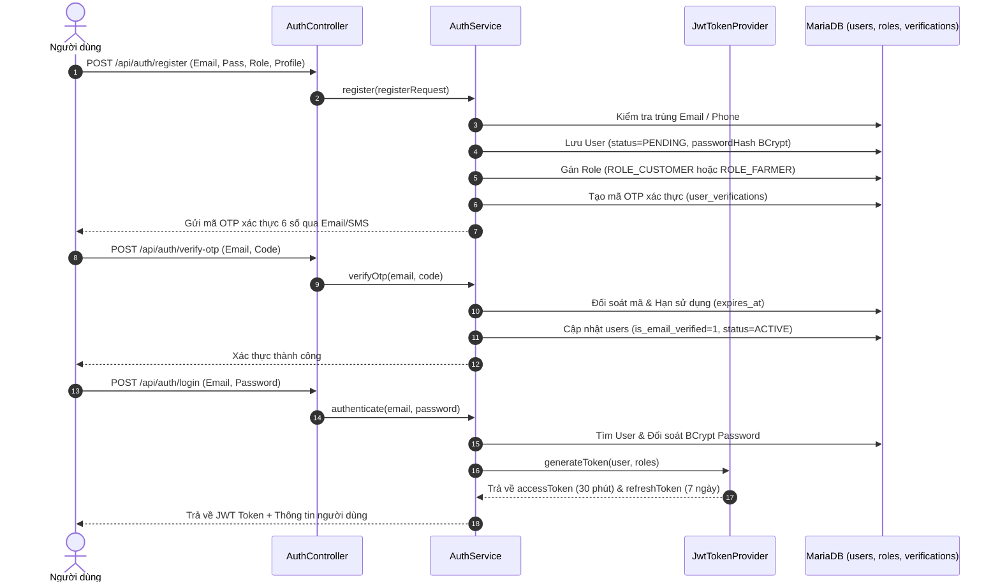
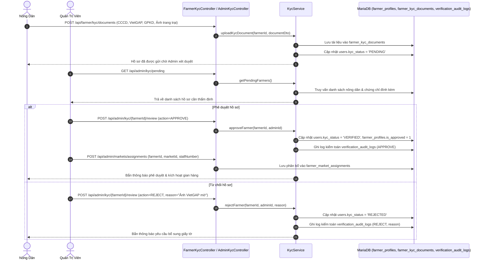
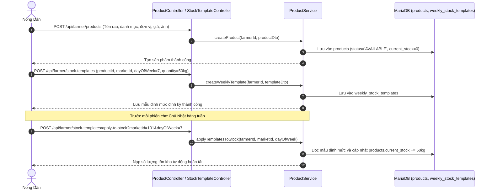
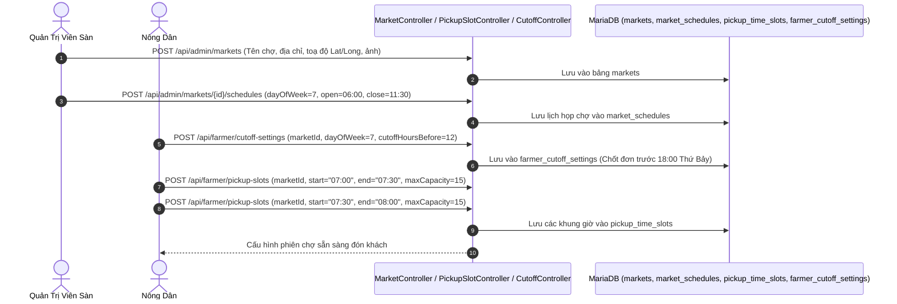
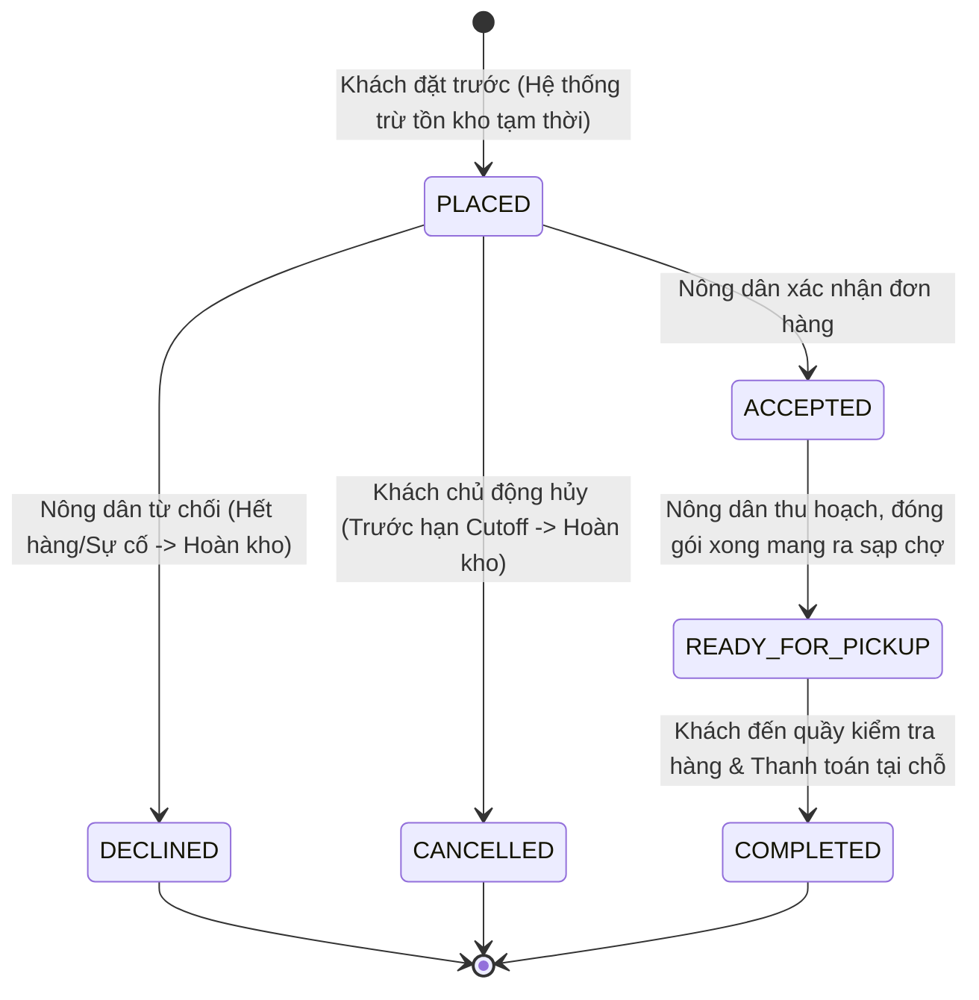
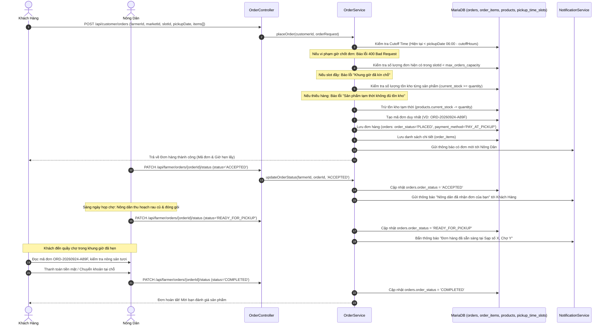
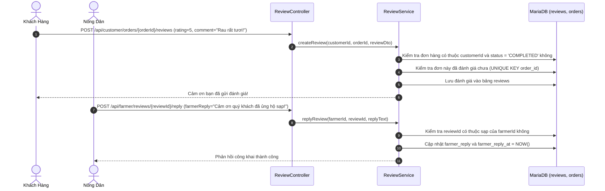
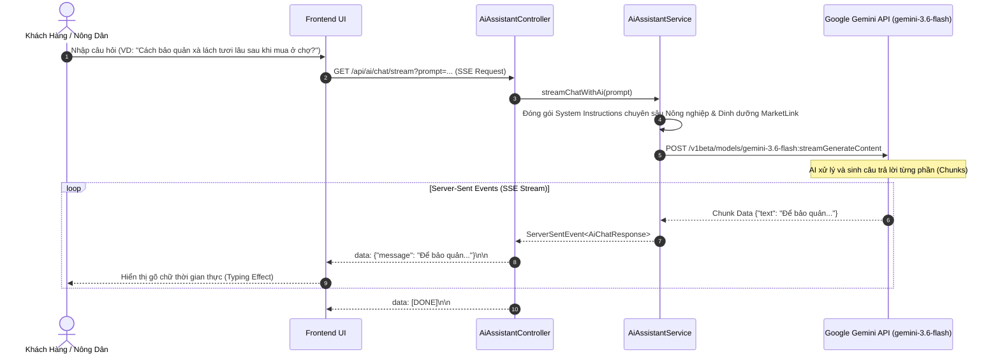

# TÀI LIỆU ĐẶC TẢ LUỒNG HOẠT ĐỘNG TOÀN DIỆN DỰ ÁN MARKETLINK (TECHWIZ 7)
> **Nền Tảng Thương Mại Điện Tử Nông Sản Sạch & Kết Nối Phiên Chợ Tương Tác (Farmers Market Pre-Order Platform)**  
> **Đơn vị phát triển:** Gravity Team • **Cuộc thi:** Techwiz 7  
> **Phiên bản:** 1.0.0 (Release Documentation) • **Ngày hoàn thiện:** Tháng 9/2026

---

## MỤC LỤC TỔNG HỢP

1. [TỔNG QUAN HỆ THỐNG & GIÁ TRỊ CỐT LÕI](#1-tổng-quan-hệ-thống--giá-trị-cốt-lõi)
2. [KIẾN TRÚC KỸ THUẬT & CÔNG NGHỆ (TECH STACK)](#2-kiến-trúc-kỹ-thuật--công-nghệ-tech-stack)
3. [SƠ ĐỒ KIẾN TRÚC TỔNG THỂ & PHÂN TẦNG](#3-sơ-đồ-kiến-trúc-tổng-thể--phân-tầng)
4. [CÁC VAI TRÒ & PHÂN QUYỀN TRUY CẬP (RBAC)](#4-các-vai-trò--phân-quyền-truy-cập-rbac)
5. [CHI TIẾT 9 LUỒNG HOẠT ĐỘNG CHÍNH CỦA HỆ THỐNG](#5-chi-tiết-9-luồng-hoạt-động-chính-của-hệ-thống)
   - [Luồng 1: Xác Thực & Quản Lý Tài Khoản (Auth & RBAC)](#luồng-1-xác-thực--quản-lý-tài-khoản-auth--rbac)
   - [Luồng 2: Thẩm Định KYC Nông Dân & Phân Bổ Sạp Chợ](#luồng-2-thẩm-định-kyc-nông-dân--phân-bổ-sạp-chợ)
   - [Luồng 3: Quản Lý Sản Phẩm & Mẫu Tồn Kho Định Kỳ (Stock Templates)](#luồng-3-quản-lý-sản-phẩm--mẫu-tồn-kho-định-kỳ-stock-templates)
   - [Luồng 4: Thiết Lập Phiên Chợ, Lịch Họp & Khung Giờ Nhận Hàng](#luồng-4-thiết-lập-phiên-chợ-lịch-họp--khung-giờ-nhận-hàng)
   - [Luồng 5: Vòng Đời Đặt Hàng Trước (Pre-Order Lifecycle - Trọng Tâm)](#luồng-5-vòng-đời-đặt-hàng-trước-pre-order-lifecycle---trọng-tâm)
   - [Luồng 6: Đánh Giá Chất Lượng & Phản Hồi Từ Nông Dân](#luồng-6-đánh-giá-chất-lượng--phản-hồi-từ-nông-dân)
   - [Luồng 7: Tài Khoản Gia Đình (Family Accounts) & Mục Yêu Thích](#luồng-7-tài-khoản-gia-đình-family-accounts--mục-yêu-thích)
   - [Luồng 8: Trợ Lý Trí Tuệ Nhân Tạo Thông Minh (Gemini AI Real-Time Streaming)](#luồng-8-trợ-lý-trí-tuệ-nhân-tạo-thông-minh-gemini-ai-real-time-streaming)
   - [Luồng 9: Dashboard Quản Trị & Báo Cáo Thống Kê Toàn Sàn](#luồng-9-dashboard-quản-trị--báo-cáo-thống-kê-toàn-sàn)
6. [MA TRẬN BẢNG TRA CỨU API ENDPOINTS](#6-ma-trận-bảng-tra-cứu-api-endpoints)
7. [MÔ HÌNH DỮ LIỆU & QUAN HỆ THỰC THỂ (DATABASE SCHEMA & ERD)](#7-mô-hình-dữ-liệu--quan-hệ-thực-thể-database-schema--erd)
8. [CƠ CHẾ BẢO MẬT & XỬ LÝ LỖI TOÀN CỤC](#8-cơ-chế-bảo-mật--xử-lý-lỗi-toàn-cục)

---

## 1. TỔNG QUAN HỆ THỐNG & GIÁ TRỊ CỐT LÕI

### 1.1. Bối cảnh & Vấn đề giải quyết
- **Khó khăn của Nông dân:** Nông sản thu hoạch mang ra các phiên chợ truyền thống thường bị thụ động về số lượng: mang quá nhiều thì ế ẩm, hư hỏng; mang quá ít thì mất doanh thu. Việc thu hoạch không sát nhu cầu gây lãng phí lớn.
- **Khó khăn của Người tiêu dùng:** Mong muốn mua nông sản tươi sạch, rõ nguồn gốc tại các chợ phiên cuối tuần nhưng ngại chen lấn, đến muộn hết hàng ngon, hoặc không biết trước phiên chợ có những mặt hàng gì.

### 1.2. Mô hình giải pháp MarketLink
**MarketLink** là nền tảng thương mại điện tử tương tác ứng dụng mô hình **Pre-Order & Pickup at Market** (Đặt trước - Nhận hàng tại phiên chợ):
1. **Đặt trước nông sản tươi:** Khách hàng duyệt danh mục sản phẩm của các nông dân đăng ký họp chợ, đặt đơn trước ngày phiên chợ diễn ra.
2. **Khung giờ chốt đơn (Cutoff Time):** Nông dân quy định hạn chót nhận đơn (ví dụ: trước 12 tiếng). Hết giờ chốt đơn, nông dân thu hoạch chính xác số lượng đặt để bảo đảm độ tươi mới 100%.
3. **Khung giờ nhận hàng (Time-Slot Capacity):** Khách chọn giờ nhận cụ thể (VD: 07:30 - 08:00), mỗi khung giờ giới hạn số lượng đơn tối đa nhằm chống ùn tắc tại sạp chợ.
4. **Nhận hàng & Thanh toán tại chợ (Pay-at-Pickup):** Khách hàng đến sạp quét mã / đọc mã đơn, kiểm tra chất lượng nông sản tận tay rồi thanh toán trực tiếp.
5. **Trợ lý AI Nông nghiệp & Dinh dưỡng:** Ứng dụng mô hình ngôn ngữ lớn Google Gemini AI hỗ trợ tư vấn canh tác, tra cứu mùa vụ, gợi ý thực đơn món ăn từ nông sản có sẵn.

---

## 2. KIẾN TRÚC KỸ THUẬT & CÔNG NGHỆ (TECH STACK)

| Thành phần | Công nghệ / Thư viện | Vai trò & Đặc điểm |
| :--- | :--- | :--- |
| **Ngôn ngữ nền tảng** | **Java 21 LTS** | Tính năng Virtual Threads, Pattern Matching, Records tối ưu hiệu suất |
| **Framework Backend** | **Spring Boot 3.4.x WebFlux** | Kiến trúc phi khối Reactive Non-blocking I/O dựa trên Project Reactor |
| **Lập trình phản ứng** | **Project Reactor (`Mono`, `Flux`)** | Xử lý đa luồng bất đồng bộ, chịu tải cao (High Throughput, Low Latency) |
| **Máy chủ Web (Server)** | **Netty Non-blocking Server** | Cổng lắng nghe mặc định: `8081`, tối ưu hóa tài nguyên RAM/CPU |
| **Cơ sở dữ liệu** | **MariaDB / MySQL 8.x** | Lưu trữ quan hệ dữ liệu toàn vẹn (ACID, Foreign Keys, Triggers) |
| **Kết nối CSDL Reactive** | **Spring Data R2DBC + `r2dbc-mysql`** | Driver bất đồng bộ 100%, không nghẽn luồng truy vấn JDBC |
| **Bảo mật & Phân quyền** | **Spring Security 6 + JJWT** | Stateless JWT Bearer Token, kiểm soát vai trò RBAC chặt chẽ |
| **Trí tuệ nhân tạo (AI)** | **Google Gemini AI (`gemini-3.6-flash`)** | Tích hợp Server-Sent Events (SSE) stream phản hồi văn bản thời gian thực |
| **Frontend Testing Studio** | **React 19 + Vite** | Giao diện Single Page Application (SPA), Dark Glassmorphism, HMR |
| **Tài liệu hóa API** | **OpenAPI 3.0 / Swagger UI** | Giao diện kiểm thử trực quan tại `/webjars/swagger-ui/index.html` |

---

## 3. SƠ ĐỒ KIẾN TRÚC TỔNG THỂ & PHÂN TẦNG

```mermaid
graph TB
    subgraph Client Layer [Tầng Giao Diện & Người Dùng]
        WebClient[React 19 Web App]
        MobileApp[Mobile Consumer App]
        AdminPortal[Admin Web Dashboard]
    end

    subgraph Gateway & Security [Tầng Cổng & Bảo Mật]
        CORS[CORS Filter]
        JwtAuthFilter[Reactive JwtAuthenticationFilter]
        SecurityChain[Spring Security 6 WebFilterChain]
    end

    subgraph Controller Layer [Tầng Điều Hướng Reactive Controllers]
        AuthController[AuthController & VerificationController]
        OrderController[OrderController & PickupSlotController]
        ProductController[ProductController & StockTemplateController]
        MarketController[MarketController & ScheduleController]
        AdminController[AdminDashboardController & AdminKycController]
        AiController[AiAssistantController - SSE Stream]
    end

    subgraph Service Business Layer [Tầng Nghiệp Vụ Reactive Services]
        AuthService[AuthService & TokenProvider]
        OrderService[OrderService & CutoffValidator]
        ProductService[ProductService & InventoryManager]
        MarketService[MarketService & GeoSpatialService]
        KycService[FarmerKycService & AuditLogger]
        AiService[AiAssistantService - Gemini Client]
    end

    subgraph Data Access Layer [Tầng Truy Cập Dữ Liệu R2DBC]
        R2dbcRepos[Spring Data R2DBC ReactiveCrudRepository]
        Database[(MariaDB / MySQL Database 18 Tables)]
    end

    subgraph External Cloud Services [Dịch Vụ Ngoại Vi Đám Mây]
        GeminiAPI[Google Generative Language API - Gemini 3.6 Flash]
        S3Storage[Cloud Storage - Ảnh/Chứng nhận KYC]
    end

    Client Layer -->|HTTP / REST / SSE| CORS
    CORS --> JwtAuthFilter
    JwtAuthFilter --> SecurityChain
    SecurityChain --> Controller Layer
    Controller Layer --> Service Business Layer
    Service Business Layer --> R2dbcRepos
    R2dbcRepos --> Database
    AiService -->|WebClient Streaming| GeminiAPI
    KycService -->|Upload/Download| S3Storage
```

---

## 4. CÁC VAI TRÒ & PHÂN QUYỀN TRUY CẬP (RBAC)

Hệ thống triển khai mô hình phân quyền dựa trên vai trò (Role-Based Access Control) thông qua `user_roles` và tiền tố bảo mật `ROLE_`:

```
                  ┌──────────────────────────────────────────────┐
                  │              NGƯỜI DÙNG CHUNG                │
                  │ (Xem chợ, danh mục, tìm kiếm rau củ, AI Chat) │
                  └──────────────────────┬───────────────────────┘
                                         │ Đăng ký / Đăng nhập
                    ┌────────────────────┼────────────────────┐
                    ▼                    ▼                    ▼
          ┌───────────────────┐┌───────────────────┐┌───────────────────┐
          │   ROLE_CUSTOMER   ││    ROLE_FARMER    ││    ROLE_ADMIN     │
          │    (Khách hàng)   ││    (Nông dân)     ││  (Quản trị viên)  │
          └─────────┬─────────┘└─────────┬─────────┘└─────────┬─────────┘
                    │                    │                    │
          ┌─────────┴─────────┐┌─────────┴─────────┐┌─────────┴─────────┐
          │- Đặt hàng trước   ││- Nộp hồ sơ KYC    ││- Phê duyệt KYC    │
          │- Chọn khung giờ   ││- Cấu hình sạp chợ ││- Tạo & mở phiên chợ│
          │- Quản lý đơn hàng ││- Đăng bán nông sản││- Phân sạp nông dân │
          │- Nhóm gia đình    ││- Lịch kho định kỳ ││- Khóa tài khoản VP│
          │- Đánh giá chất lg ││- Tiếp nhận đơn pre││- Thống kê toàn sàn│
          └───────────────────┘└───────────────────┘└───────────────────┘
```

1. **ROLE_CUSTOMER (Khách hàng cá nhân & Gia đình):**
   - Đặt trước nông sản theo sạp chợ, quản lý giỏ hàng pre-order.
   - Chọn khung giờ lấy hàng (Pickup Slot) và hủy đơn trước giờ Cutoff.
   - Tạo nhóm tài khoản gia đình (`family_accounts`), chia sẻ đơn hàng.
   - Viết đánh giá (Rating 1-5 sao) sau khi đơn hoàn tất.
2. **ROLE_FARMER (Nông dân / Hợp tác xã):**
   - Nộp hồ sơ định danh & chứng chỉ chất lượng (VietGAP, ATTP, OCOP).
   - Thiết lập sạp chợ được duyệt, thời gian chốt đơn (`cutoff_hours_before`).
   - Quản lý danh mục sản phẩm, giá bán, số lượng kho thực tế.
   - Lập mẫu tồn kho định kỳ (`weekly_stock_templates`) theo từng ngày họp chợ.
   - Nhận thông báo đơn đặt mới, bấm tiếp nhận (`ACCEPTED`), soạn hàng (`READY_FOR_PICKUP`), hoàn thành đơn (`COMPLETED`).
3. **ROLE_ADMIN (Ban quản lý sàn):**
   - Khởi tạo chợ nông sản, định vị tọa độ GPS, lập lịch họp chợ trong tuần.
   - Thẩm định hồ sơ KYC của nông dân, phê duyệt/từ chối kèm biên bản kiểm toán.
   - Phân bổ số thứ tự sạp (`stall_number`) cho từng nông dân tại các chợ.
   - Theo dõi chỉ số toàn sàn, doanh thu từng chợ và bảng xếp hạng nông dân tích cực.

---

## 5. CHI TIẾT 9 LUỒNG HOẠT ĐỘNG CHÍNH CỦA HỆ THỐNG

---

### Luồng 1: Xác Thực & Quản Lý Tài Khoản (Auth & RBAC)



- **Mục đích:** Đảm bảo đăng ký an toàn, xác minh danh tính qua OTP và cấp phát JWT Token chuẩn RFC-7519.
- **Các bước thực thi:**
  1. Người dùng gửi yêu cầu đăng ký kèm vai trò mong muốn (`CUSTOMER` hoặc `FARMER`).
  2. Hệ thống kiểm tra trùng lặp email/SĐT, mã hóa mật khẩu bằng **BCrypt (10 rounds)**, tạo bản ghi `users` với trạng thái `PENDING`.
  3. Hệ thống tạo mã xác nhận ngẫu nhiên 6 chữ số lưu vào `user_verifications` với thời hạn hiệu lực 24 giờ.
  4. Sau khi người dùng nhập đúng OTP, trạng thái tài khoản chuyển thành `ACTIVE`.
  5. Đăng nhập thành công trả về `accessToken` chứa claims (userId, sub=email, roles) và `refreshToken`.

---

### Luồng 2: Thẩm Định KYC Nông Dân & Phân Bổ Sạp Chợ



- **Mục đích:** Kiểm soát nghiêm ngặt nguồn gốc hàng hóa, chỉ nông dân có hồ sơ hợp lệ mới được bán hàng.
- **Tiêu chuẩn tài liệu KYC hỗ trợ:**
  - `CITIZEN_ID_FRONT`, `CITIZEN_ID_BACK`: Căn cước công dân của chủ nông trại.
  - `BUSINESS_REGISTRATION`: Giấy phép kinh doanh hợp tác xã/hộ nông nghiệp.
  - `FOOD_SAFETY_CERT`: Giấy chứng nhận cơ sở đủ điều kiện An toàn Thực phẩm.
  - `ORGANIC_VIETGAP_CERT`: Chứng nhận Nông sản hữu cơ / VietGAP / GlobalGAP.
- **Tính năng kiểm toán (Audit Trail):** Mọi thao tác phê duyệt hay từ chối của Admin đều bắt buộc lưu `admin_id`, `action`, `reason`, `reviewed_at` vào bảng `verification_audit_logs`.

---

### Luồng 3: Quản Lý Sản Phẩm & Mẫu Tồn Kho Định Kỳ (Stock Templates)



- **Điểm sáng tạo - Weekly Stock Templates:** Thay vì phải nhập lại số lượng từng loại rau củ mỗi tuần, nông dân chỉ cần tạo mẫu định mức (VD: Mỗi Chủ Nhật bán 50 bó cải ngọt, 30kg cà chua tại Chợ Cầu Giấy). Hệ thống hỗ trợ nạp tự động vào `current_stock` giúp tiết kiệm thời gian vận hành.

---

### Luồng 4: Thiết Lập Phiên Chợ, Lịch Họp & Khung Giờ Nhận Hàng



- **Cơ chế chống ùn tắc quầy chợ:** Mỗi khung giờ nhận hàng (`pickup_time_slots`) có trường `max_orders_capacity`. Khi khách hàng đặt đơn chọn khung giờ này, hệ thống đếm số đơn hiện có. Nếu đã đạt tối đa (VD: 15 đơn/khung 30 phút), hệ thống sẽ khóa khung giờ này và yêu cầu khách chọn khung giờ khác.

---

### Luồng 5: Vòng Đời Đặt Hàng Trước (Pre-Order Lifecycle - Trọng Tâm)

Đây là **luồng nghiệp vụ cốt lõi quan trọng nhất** của hệ thống MarketLink.



#### Chi tiết tương tác Sequence Diagram luồng Đặt Hàng:



- **Quy tắc hoàn kho tự động (Inventory Rollback):**
  - Nếu Nông dân bấm `DECLINED` (từ chối): Hệ thống tự động `current_stock += item.quantity`.
  - Nếu Khách hàng bấm `CANCELLED` (hủy đơn trước thời hạn `cutoff_time`): Hệ thống kiểm tra điều kiện thời gian thực. Nếu hợp lệ, chuyển trạng thái `CANCELLED` và tự động hoàn trả số lượng vào kho của nông dân.

---

### Luồng 6: Đánh Giá Chất Lượng & Phản Hồi Từ Nông Dân



---

### Luồng 7: Tài Khoản Gia Đình (Family Accounts) & Mục Yêu Thích

1. **Nhóm gia đình (Family Accounts):**
   - Người tiêu dùng có thể mời người thân (vợ/chồng, bố mẹ) tham gia cùng nhóm thông qua email.
   - Hệ thống tạo mã liên kết `invitation_token` với thời hạn 7 ngày lưu tại `family_account_invitations`.
   - Khi người thân chấp nhận lời mời, trường `family_account_id` trong `customer_profiles` được liên kết về người đại diện gia đình. Các thành viên có thể xem chung lịch hẹn lấy hàng tại chợ.
2. **Mục yêu thích (Favorites):**
   - Khách hàng lưu nông dân uy tín (`FARMER`), rau củ theo mùa (`PRODUCT`) hoặc điểm chợ gần nhà (`MARKET`) vào danh sách theo dõi tại `favorites`.
   - Mỗi khi nông dân yêu thích cập nhật bảng giá hoặc mở đăng ký họp chợ mới, hệ thống tự động sinh thông báo `RESTOCK_ALERT`.

---

### Luồng 8: Trợ Lý Trí Tuệ Nhân Tạo Thông Minh (Gemini AI Real-Time Streaming)



- **Mô hình AI sử dụng:** `gemini-3.6-flash` (Google DeepMind).
- **Cơ chế truyền tải:** **Server-Sent Events (SSE)** kết hợp `Flux<ServerSentEvent<AiChatResponse>>` của Spring WebFlux:
  - Phản hồi tức thì, không bị timeout khi câu trả lời dài.
  - Người dùng có thể nhấn nút "Dừng phản hồi" (`stopAiStream`) bất kỳ lúc nào để hủy luồng tiết kiệm token.
- **Kịch bản ứng dụng:**
  - *Dành cho Khách hàng:* Gợi ý thực đơn bữa cơm gia đình từ các loại rau củ đang bán tại chợ phiên; tư vấn mẹo bảo quản nông sản không chất bảo quản.
  - *Dành cho Nông dân:* Tư vấn xử lý sâu bệnh sinh học hữu cơ, cách chăm sóc rau vụ đông xuân, cách định giá cạnh tranh theo biến động thị trường.

---

### Luồng 9: Dashboard Quản Trị & Báo Cáo Thống Kê Toàn Sàn

Quản trị viên sàn có bảng điều khiển trung tâm để theo dõi toàn bộ sức khỏe tài chính và hoạt động của nền tảng:

```mermaid
graph LR
    subgraph Metrics Aggregator [Tổng hợp chỉ số]
        M1[Tổng số Nông dân]
        M2[Tổng số Khách hàng]
        M3[Tổng số Chợ họp]
        M4[Tổng Đơn hàng hoàn tất]
        M5[Tổng Doanh thu toàn sàn]
        M6[Số hồ sơ KYC chờ duyệt]
    end

    subgraph Analytics Reports [Báo cáo chuyên sâu]
        R1[Báo cáo Doanh thu & Đơn hàng theo từng Chợ]
        R2[Bảng xếp hạng Top Nông dân tích cực nhất]
    end

    Admin[👑 Quản Trị Viên] -->|GET /api/admin/dashboard/metrics| Metrics Aggregator
    Admin -->|GET /api/admin/dashboard/reports/markets| R1
    Admin -->|GET /api/admin/dashboard/reports/most-active-farmers| R2
```

- **Báo cáo Doanh thu theo Chợ (`/api/admin/dashboard/reports/markets`):** Tổng hợp doanh số thực tế, số đơn hoàn thành và số lượng nông dân có mặt tại từng phiên chợ (VD: Chợ Cầu Giấy, Chợ Ba Đình, Chợ Thảo Điền).
- **Xếp hạng Nông dân (`/api/admin/dashboard/reports/most-active-farmers`):** Thống kê top những nông dân có số đơn hoàn thành cao nhất và doanh thu tốt nhất, hỗ trợ chính sách vinh danh và ưu đãi vị trí sạp đẹp.

---

## 6. MA TRẬN BẢNG TRA CỨU API ENDPOINTS

Dưới đây là bảng tổng hợp các API chính được phân nhóm theo nghiệp vụ:

### Nhóm 1: Xác Thực & Tài Khoản (`/api/auth`, `/api/users`)
| Method | Endpoint URI | Phân quyền | Chức năng nghiệp vụ |
| :--- | :--- | :--- | :--- |
| `POST` | `/api/auth/register` | Public | Đăng ký tài khoản (Khách hàng hoặc Nông dân) |
| `POST` | `/api/auth/login` | Public | Đăng nhập hệ thống, cấp phát JWT Bearer Token |
| `POST` | `/api/auth/verify-otp` | Public | Xác thực số điện thoại / Email bằng mã OTP |
| `POST` | `/api/auth/forgot-password` | Public | Gửi yêu cầu đặt lại mật khẩu |
| `POST` | `/api/auth/reset-password` | Public | Xác nhận đổi mật khẩu mới qua mã xác minh |
| `GET` | `/api/users/profile` | Authenticated | Lấy thông tin cá nhân của tài khoản đăng nhập |
| `PUT` | `/api/users/profile` | Authenticated | Cập nhật họ tên, địa chỉ, ảnh đại diện |
| `PUT` | `/api/users/profile/password` | Authenticated | Đổi mật khẩu tài khoản |

### Nhóm 2: Chợ Nông Sản & Lịch Họp (`/api/markets`, `/api/admin/markets`)
| Method | Endpoint URI | Phân quyền | Chức năng nghiệp vụ |
| :--- | :--- | :--- | :--- |
| `GET` | `/api/markets` | Public | Lấy danh sách điểm chợ kèm tọa độ GPS ghim bản đồ |
| `GET` | `/api/markets/{id}` | Public | Lấy chi tiết thông tin và lịch họp của một chợ |
| `GET` | `/api/markets/{id}/farmers` | Public | Lấy danh sách nông dân & số sạp đang họp tại chợ |
| `POST` | `/api/admin/markets` | `ROLE_ADMIN` | Quản trị viên thêm điểm chợ nông sản mới |
| `PUT` | `/api/admin/markets/{id}` | `ROLE_ADMIN` | Cập nhật thông tin địa điểm chợ |
| `DELETE` | `/api/admin/markets/{id}` | `ROLE_ADMIN` | Tạm dừng hoạt động điểm chợ |
| `POST` | `/api/admin/markets/assignments` | `ROLE_ADMIN` | Phân bổ số thứ tự sạp cho nông dân tại chợ |

### Nhóm 3: Sản Phẩm, Danh Mục & Tồn Kho (`/api/products`, `/api/farmer`)
| Method | Endpoint URI | Phân quyền | Chức năng nghiệp vụ |
| :--- | :--- | :--- | :--- |
| `GET` | `/api/categories` | Public | Lấy cây danh mục nông sản (Rau, Củ, Quả, Trứng...) |
| `GET` | `/api/products` | Public | Lấy danh sách nông sản (lọc theo danh mục/từ khóa) |
| `GET` | `/api/products/{id}` | Public | Xem thông tin chi tiết một sản phẩm |
| `GET` | `/api/products/search` | Public | Tìm kiếm nâng cao sản phẩm theo từ khóa |
| `POST` | `/api/farmer/products` | `ROLE_FARMER` | Nông dân đăng bán nông sản mới |
| `PUT` | `/api/farmer/products/{id}` | `ROLE_FARMER` | Nông dân chỉnh sửa thông tin, giá bán |
| `DELETE` | `/api/farmer/products/{id}` | `ROLE_FARMER` | Xóa hoặc ẩn sản phẩm khỏi sạp |
| `GET` | `/api/farmer/stock-templates` | `ROLE_FARMER` | Xem danh sách mẫu định mức tồn kho định kỳ |
| `POST` | `/api/farmer/stock-templates` | `ROLE_FARMER` | Tạo mới mẫu định mức tồn kho theo ngày họp chợ |
| `DELETE`| `/api/farmer/stock-templates/{id}`| `ROLE_FARMER` | Xóa mẫu định mức định kỳ |

### Nhóm 4: Đơn Hàng Pre-Order (`/api/customer/orders`, `/api/farmer/orders`)
| Method | Endpoint URI | Phân quyền | Chức năng nghiệp vụ |
| :--- | :--- | :--- | :--- |
| `POST` | `/api/customer/orders` | `ROLE_CUSTOMER` | Đặt hàng trước nông sản theo sạp chợ & khung giờ |
| `GET` | `/api/customer/orders` | `ROLE_CUSTOMER` | Xem lịch sử đơn hàng của khách hàng |
| `GET` | `/api/customer/orders/{id}` | `ROLE_CUSTOMER` | Xem chi tiết đơn hàng & thời gian hẹn lấy |
| `POST` | `/api/customer/orders/{id}/cancel` | `ROLE_CUSTOMER` | Hủy đơn trước hạn Cutoff (tự động hoàn kho) |
| `GET` | `/api/farmer/orders` | `ROLE_FARMER` | Nông dân xem danh sách đơn khách đặt trước |
| `PATCH`| `/api/farmer/orders/{id}/status`| `ROLE_FARMER` | Cập nhật trạng thái đơn (ACCEPTED, READY, COMPLETED)|
| `GET` | `/api/farmer/orders/summary` | `ROLE_FARMER` | Thống kê số lượng đơn theo các trạng thái |
| `GET` | `/api/farmer/orders/insights/best-selling`| `ROLE_FARMER`| Xem bảng xếp hạng sản phẩm bán chạy nhất sạp |

### Nhóm 5: Thẩm Định KYC & Báo Cáo Admin (`/api/admin`)
| Method | Endpoint URI | Phân quyền | Chức năng nghiệp vụ |
| :--- | :--- | :--- | :--- |
| `GET` | `/api/admin/users` | `ROLE_ADMIN` | Danh sách người dùng sàn & trạng thái tài khoản |
| `POST` | `/api/admin/users/{id}/status` | `ROLE_ADMIN` | Khóa hoặc kích hoạt lại tài khoản người dùng |
| `GET` | `/api/admin/kyc/pending` | `ROLE_ADMIN` | Lấy danh sách hồ sơ nông dân đang chờ thẩm định |
| `POST` | `/api/admin/kyc/{farmerId}/review` | `ROLE_ADMIN` | Phê duyệt hoặc từ chối hồ sơ KYC nông dân |
| `GET` | `/api/admin/dashboard/metrics` | `ROLE_ADMIN` | Thống kê chỉ số cốt lõi toàn sàn |
| `GET` | `/api/admin/dashboard/reports/markets` | `ROLE_ADMIN` | Báo cáo doanh thu & đơn hàng phân bổ theo chợ |
| `GET` | `/api/admin/dashboard/reports/most-active-farmers`| `ROLE_ADMIN`| Xếp hạng top nông dân tích cực nhất |

### Nhóm 6: Trí Tuệ Nhân Tạo Gemini AI (`/api/ai`)
| Method | Endpoint URI | Phân quyền | Chức năng nghiệp vụ |
| :--- | :--- | :--- | :--- |
| `GET` | `/api/ai/chat/stream` | Public / Auth | Chat AI phát trực tiếp (SSE Stream - Real-Time) |
| `POST` | `/api/ai/chat` | Public / Auth | Chat AI dạng phản hồi đóng gói JSON thông thường |

---

## 7. MÔ HÌNH DỮ LIỆU & QUAN HỆ THỰC THỂ (DATABASE SCHEMA & ERD)

Cơ sở dữ liệu của dự án gồm **18 bảng liên kết chặt chẽ**, được thiết kế theo chuẩn dạng chuẩn 3NF:

```
                            ┌──────────────┐
                            │    ROLES     │
                            └──────┬───────┘
                                   │
                                   ▼
┌─────────────────────────┐  ┌──────────────┐  ┌─────────────────────────┐
│   USER_VERIFICATIONS    │◄─┤    USERS     ├─►│ VERIFICATION_AUDIT_LOGS │
└─────────────────────────┘  └──────┬───────┘  └─────────────────────────┘
                                    │
           ┌────────────────────────┴────────────────────────┐
           ▼                                                 ▼
┌───────────────────────┐                         ┌───────────────────────┐
│   CUSTOMER_PROFILES   │                         │    FARMER_PROFILES    │
└──────────┬────────────┘                         └──────────┬────────────┘
           │                                                 │
           ├────────────────────────┬────────────────────────┤
           │                        │                        │
           ▼                        ▼                        ▼
┌───────────────────────┐┌───────────────────────┐┌───────────────────────┐
│       FAVORITES       ││        ORDERS         ││       PRODUCTS        │
└───────────────────────┘└──────────┬────────────┘└──────────┬────────────┘
                                    │                        │
                                    ▼                        ▼
┌───────────────────────┐┌───────────────────────┐┌───────────────────────┐
│        REVIEWS        ││      ORDER_ITEMS      ││WEEKLY_STOCK_TEMPLATES │
└───────────────────────┘└───────────────────────┘└───────────────────────┘
                                    ▲
                                    │
                         ┌──────────┴──────────┐
                         │   MARKETS & SLOTS   │
                         │(markets, schedules, │
                         │ pickup_time_slots)  │
                         └─────────────────────┘
```

### Danh sách 18 bảng dữ liệu:
1. `roles`: Danh mục quyền hệ thống (`ROLE_ADMIN`, `ROLE_FARMER`, `ROLE_CUSTOMER`).
2. `users`: Tài khoản đăng nhập chính, email, mật khẩu BCrypt, SĐT, trạng thái KYC.
3. `user_roles`: Bảng nối người dùng và quyền (Many-to-Many).
4. `user_verifications`: Lưu trữ mã OTP xác minh email, số điện thoại, đặt lại mật khẩu.
5. `customer_profiles`: Hồ sơ người tiêu dùng, địa chỉ mặc định, tọa độ, nhóm gia đình.
6. `family_account_invitations`: Lời mời tham gia tài khoản nhóm gia đình.
7. `farmer_profiles`: Hồ sơ nhà vườn, tên sạp hàng, giới thiệu, địa chỉ trang trại.
8. `farmer_kyc_documents`: File chứng nhận CCCD, VietGAP, Giấy phép KD, ATTP.
9. `verification_audit_logs`: Lịch sử kiểm toán duyệt/từ chối KYC của Quản trị viên.
10. `markets`: Danh sách các điểm chợ nông sản, địa chỉ, kinh độ, vĩ độ ghim bản đồ.
11. `market_schedules`: Lịch mở/đóng cửa chợ theo từng ngày trong tuần.
12. `farmer_market_assignments`: Phân bổ nông dân nào bán ở chợ nào, số thứ tự sạp.
13. `pickup_time_slots`: Các khung giờ nhận hàng (VD: 07:00 - 07:30) kèm sức chứa đơn.
14. `farmer_cutoff_settings`: Thời hạn chốt đơn trước giờ mở chợ của nông dân.
15. `categories`: Danh mục phân loại nông sản (Rau ăn lá, Củ quả, Trái cây, Trứng sữa...).
16. `products`: Chi tiết nông sản, giá bán, đơn vị tính (kg/bó/hộp), tồn kho thực tế.
17. `weekly_stock_templates`: Mẫu nạp số lượng hàng định kỳ cho từng phiên chợ.
18. `orders` & `order_items`: Đơn đặt hàng trước, mã đơn, tổng tiền, trạng thái, thanh toán.
19. `reviews`: Đánh giá 1-5 sao, bình luận của khách và câu trả lời của nông dân.
20. `favorites`: Danh sách nông dân, sản phẩm hoặc chợ yêu thích của người dùng.
21. `notifications`: Hệ thống thông báo đẩy trong ứng dụng.
22. `system_announcements`: Thông báo chung của ban quản trị sàn.

---

## 8. CƠ CHẾ BẢO MẬT & XỬ LÝ LỖI TOÀN CỤC

### 8.1. Cơ chế bảo mật (Security Mechanism)
1. **Stateless JWT Authentication:**
   - Mã hóa chữ ký HMAC-SHA256 với secret key an toàn.
   - Access Token có thời hạn 30 phút; Refresh Token có thời hạn 7 ngày.
   - Bộ lọc phản ứng `JwtAuthenticationFilter` tự động trích xuất token từ Header `Authorization: Bearer <token>`, giải mã claims và thiết lập `SecurityContext` của WebFlux.
2. **Path Regex Matching chống xung đột URL:**
   - Các đường dẫn có tham số ID được bảo vệ bằng biểu thức chính quy (Regex) ví dụ: `/{id:[0-9]+}` nhằm triệt tiêu hoàn toàn lỗi xung đột đường dẫn tĩnh như `/search`, `/summary`, `/metrics`.
3. **CORS Configuration:**
   - Cấu hình cho phép các nguồn gốc an toàn từ Frontend React (`http://localhost:5173`, `http://localhost:3000`) với đầy đủ các phương thức `GET, POST, PUT, DELETE, PATCH, OPTIONS`.

### 8.2. Xử lý ngoại lệ tập trung (Global Exception Handling)
Lớp `GlobalExceptionHandler` bắt và chuẩn hóa mọi lỗi về một định dạng JSON thống nhất `ApiResponse<T>`:
```json
{
  "success": false,
  "message": "Chi tiết thông điệp lỗi thân thiện với người dùng",
  "data": null,
  "timestamp": "2026-09-24T23:00:00.000000"
}
```
- Mã lỗi **400 Bad Request**: Sai thông tin đầu vào, vi phạm giờ Cutoff, hết tồn kho.
- Mã lỗi **401 Unauthorized**: Token thiếu, sai chữ ký hoặc đã hết hạn.
- Mã lỗi **403 Forbidden**: Người dùng không có quyền truy cập endpoint (VD: Khách hàng gọi API duyệt KYC).
- Mã lỗi **404 Not Found**: Tài nguyên không tồn tại.
- Mã lỗi **500 Internal Server Error**: Lỗi máy chủ không mong muốn, được ghi log đầy đủ kèm stack trace ẩn giấu để bảo mật.

---

## KẾT LUẬN

Tài liệu này phản ánh toàn bộ kiến trúc, luồng dữ liệu nghiệp vụ và các chức năng đã được hiện thực hóa đầy đủ, đồng bộ và kiểm thử thành công trên hệ thống **MarketLink Backend (Spring Boot WebFlux R2DBC)** và **MarketLink Frontend Studio (React 19 + Vite)**.

> 📄 *Tài liệu được kết xuất phục vụ công tác báo cáo đồ án, thuyết trình Techwiz 7 và bàn giao kỹ thuật.*
