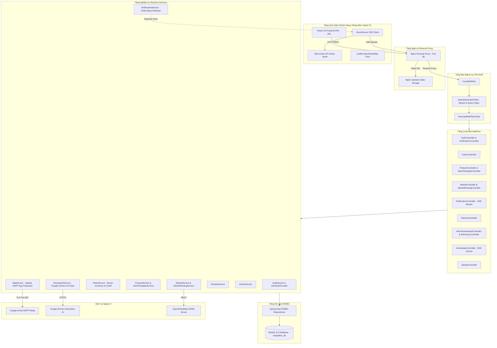
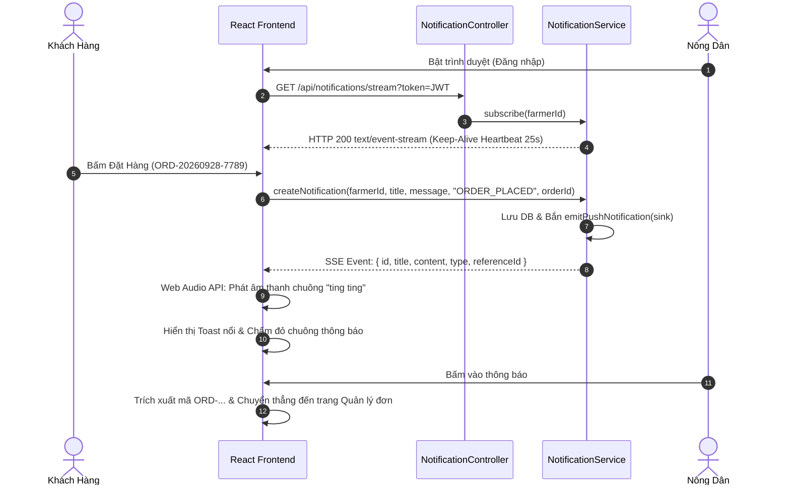

# TÀI LIỆU ĐẶC TẢ CHI TIẾT LUỒNG HOẠT ĐỘNG & CÔNG NGHỆ TOÀN BỘ HỆ THỐNG MARKETLINK
> **Nền Tảng Thương Mại Điện Tử Nông Sản Sạch & Kết Nối Phiên Chợ Tương Tác (Farmers Market Pre-Order Platform)**  
> **Dự án:** MarketLink • **Đơn vị phát triển:** Gravity Team (Techwiz 7)  
> **Phiên bản:** 3.0.0 (Cập nhật đầy đủ Real-time SSE Push Notification, Email OTP Verification, Inventory Lifecycle & AI Assistant)  
> **Thời gian cập nhật:** Tháng 09/2026  

---

## 📑 MỤC LỤC TỔNG QUAN

1. [TỔNG QUAN KIẾN TRÚC & NỀN TẢNG CÔNG NGHỆ CHUNG](#1-tổng-quan-kiến-trúc--nền-tảng-công-nghệ-chung)
2. [SƠ ĐỒ TỔNG THỂ KIẾN TRÚC HỆ THỐNG](#2-sơ-đồ-tổng-thể-kiến-trúc-hệ-thống)
3. [MA TRẬN CÔNG NGHỆ THEO TỪNG CHỨC NĂNG](#3-ma-trận-công-nghệ-theo-từng-chức-năng)
4. [CHI TIẾT LUỒNG HOẠT ĐỘNG 34 CHỨC NĂNG RIÊNG BIỆT](#4-chi-tiết-luồng-hoạt-động-34-chức-năng-riêng-biệt)
   - [PHÂN HỆ I: XÁC THỰC, BẢO MẬT & TÀI KHOẢN](#phân-hệ-i-xác-thực-bảo-mật--tài-khoản)
     - [CN 01: Đăng ký Tài khoản (Customer & Farmer)](#cn-01-đăng-ký-tài-khoản-customer--farmer)
     - [CN 02: Đăng nhập & Cấp phát JWT Access/Refresh Token](#cn-02-đăng-nhập--cấp-phát-jwt-accessrefresh-token)
     - [CN 03: Xác thực OTP qua Email & Đặt lại Mật khẩu](#cn-03-xác-thực-otp-qua-email--đặt-lại-mật-khẩu)
     - [CN 04: Quản lý Hồ sơ Khách hàng & Cập nhật Avatar](#cn-04-quản-lý-hồ-sơ-khách-hàng--cập-nhật-avatar)
     - [CN 05: Đăng ký Hồ sơ Nông dân & Nộp Thẩm định KYC](#cn-05-đăng-ký-hồ-sơ-nông-dân--nộp-thẩm-định-kyc)
     - [CN 06: Nhóm Tài khoản Gia đình (Family Accounts)](#cn-06-nhóm-tài-khoản-gia-đình-family-accounts)
     - [CN 07: Bộ lọc Phân quyền Bảo mật (Reactive Security Filter Chain)](#cn-07-bộ-lọc-phân-quyền-bảo-mật-reactive-security-filter-chain)
   - [PHÂN HỆ II: CHỢ PHIÊN & KHUNG GIỜ NHẬN HÀNG](#phân-hệ-ii-chợ-phiên--khung-giờ-nhận-hàng)
     - [CN 08: Khám phá Danh sách Chợ Nông sản Phiên](#cn-08-khám-phá-danh-sách-chợ-nông-sản-phiên)
     - [CN 09: Quản lý Lịch họp Chợ & Ca nhận hàng (Pickup Slots Capacity)](#cn-09-quản-lý-lịch-họp-chợ--ca-nhận-hàng-pickup-slots-capacity)
     - [CN 10: Nông dân Đăng ký Tham gia Chợ & Cấp số sạp](#cn-10-nông-dân-đăng-ký-tham-gia-chợ--cấp-số-sạp)
     - [CN 11: Bản đồ OpenStreetMap, Tìm đường OSRM & Geofencing GPS 300m](#cn-11-bản-đồ-openstreetmap-tìm-đường-osrm--geofencing-gps-300m)
   - [PHÂN HỆ III: SẢN PHẨM & QUẢN TRỊ TỒN KHO](#phân-hệ-iii-sản-phẩm--quản-trị-tồn-kho)
     - [CN 12: Quản lý Danh mục & Đăng bán Nông sản](#cn-12-quản-lý-danh-mục--đăng-bán-nông-sản)
     - [CN 13: Cập nhật Tồn kho Nhanh & Bật/Tắt Nhận Đặt Hàng](#cn-13-cập-nhật-tồn-kho-nhanh--bậttắt-nhận-đặt-hàng)
     - [CN 14: Cấu hình Giờ chốt đơn (Farmer Cutoff Settings)](#cn-14-cấu-hình-giờ-chốt-đơn-farmer-cutoff-settings)
     - [CN 15: Mẫu Định mức Tồn kho Hàng tuần (Weekly Stock Templates)](#cn-15-mẫu-định-mức-tồn-kho-hàng-tuần-weekly-stock-templates)
     - [CN 16: Tải lên & Lưu trữ Tệp/Hình ảnh Zero-Copy](#cn-16-tải-lên--lưu-trữ-tệphình-ảnh-zero-copy)
   - [PHÂN HỆ IV: ĐẶT HÀNG TRƯỚC & VÒNG ĐỜI ĐƠN HÀNG (PRE-ORDER LIFECYCLE)](#phân-hệ-iv-đặt-hàng-trước--vòng-đời-đơn-hàng-pre-order-lifecycle)
     - [CN 17: Khách hàng Đặt trước Nông sản (Pre-Order Placement)](#cn-17-khách-hàng-đặt-trước-nông-sản-pre-order-placement)
     - [CN 18: Khấu trừ & Khóa Tồn kho Tự động (Atomic Stock Deduction)](#cn-18-khấu-trừ--khóa-tồn-kho-tự-động-atomic-stock-deduction)
     - [CN 19: Khách hàng Điều chỉnh Đơn hàng trước Giờ chốt (Modify Order)](#cn-19-khách-hàng-điều-chỉnh-đơn-hàng-trước-giờ-chốt-modify-order)
     - [CN 20: Khách hàng Hủy Đơn & Hoàn Tồn kho Tự động (Cancel Order)](#cn-20-khách-hàng-hủy-đơn--hoàn-tồn-kho-tự-động-cancel-order)
     - [CN 21: Nông dân Tiếp nhận Đơn & Đóng gói Sẵn sàng (Accept & Ready)](#cn-21-nông-dân-tiếp-nhận-đơn--đóng-gói-sẵn-sàng-accept--ready)
     - [CN 22: Nông dân Từ chối Đơn & Bảo vệ Tồn kho Kết thúc (Decline Order)](#cn-22-nông-dân-từ-chối-đơn--bảo-vệ-tồn-kho-kết-thúc-decline-order)
     - [CN 23: Xác nhận Nhận hàng & Thanh toán tại Sạp (Complete Order)](#cn-23-xác-nhận-nhận-hàng--thanh-toán-tại-sạp-complete-order)
     - [CN 24: Tra cứu, Bộ lọc Đa tiêu chí & Nút Xóa nhanh Đơn hàng](#cn-24-tra-cứu-bộ-lọc-đa-tiêu-chí--nút-xóa-nhanh-đơn-hàng)
   - [PHÂN HỆ V: ĐÁNH GIÁ & UY TÍN NHÀ VƯỜN](#phân-hệ-v-đánh-giá--uy-tín-nhà-vườn)
     - [CN 25: Khách hàng Đánh giá Nông sản & Chấm điểm Sạp Chợ](#cn-25-khách-hàng-đánh-giá-nông-sản--chấm-điểm-sạp-chợ)
     - [CN 26: Nông dân Quản trị Đánh giá & Thống kê Tín nhiệm](#cn-26-nông-dân-quản-trị-đánh-giá--thống-kê-tín-nhiệm)
   - [PHÂN HỆ VI: THÔNG BÁO ĐẨY THỜI GIAN THỰC (REAL-TIME SSE PUSH)](#phân-hệ-vi-thông-báo-đẩy-thời-gian-thực-real-time-sse-push)
     - [CN 27: Luồng đẩy Sự kiện Server-Sent Events (SSE Stream)](#cn-27-luồng-đẩy-sự-kiện-server-sent-events-sse-stream)
     - [CN 28: Điều hướng Thông minh theo Vai trò & Xử lý Trạng thái Đọc](#cn-28-điều-hướng-thông-minh-theo-vai-trò--xử-lý-trạng-thái-đọc)
     - [CN 29: Bộ tổng hợp Âm thanh Web Audio API & Desktop Push Notifications](#cn-29-bộ-tổng-hợp-âm-thanh-web-audio-api--desktop-push-notifications)
   - [PHÂN HỆ VII: TRỢ LÝ TRÍ TUỆ NHÂN TẠO GOOGLE GEMINI AI](#phân-hệ-vii-trợ-lý-trí-tuệ-nhân-tạo-google-gemini-ai)
     - [CN 30: Trợ lý AI Tư vấn Nông nghiệp & Phiên chợ Streaming](#cn-30-trợ-lý-ai-tư-vấn-nông-nghiệp--phiên-chợ-streaming)
   - [PHÂN HỆ VIII: QUẢN TRỊ HỆ THỐNG & PHÂN TÍCH (ADMIN DASHBOARD)](#phân-hệ-viii-quản-trị-hệ-thống--phân-tích-admin-dashboard)
     - [CN 31: Thẩm định & Phê duyệt Hồ sơ Nông dân (Admin KYC Audit)](#cn-31-thẩm-định--phê-duyệt-hồ-sơ-nông-dân-admin-kyc-audit)
     - [CN 32: Kiểm duyệt & Khóa Sản phẩm Vi phạm (Product Moderation)](#cn-32-kiểm-duyệt--khóa-sản-phẩm-vi-phạm-product-moderation)
     - [CN 33: Quản trị Tài khoản Người dùng & Khóa Truy cập](#cn-33-quản-trị-tài-khoản-người-dùng--khóa-truy-cập)
     - [CN 34: Dashboard Thống kê Doanh thu & Chỉ số Hệ thống](#cn-34-dashboard-thống-kê-doanh-thu--chỉ-số-hệ-thống)
5. [QUY TRÌNH DEPLOY & HẠ TẦNG VẬN HÀNH VPS PRODUCTION](#5-quy-trình-deploy--hạ-tầng-vận-hành-vps-production)

---

## 1. TỔNG QUAN KIẾN TRÚC & NỀN TẢNG CÔNG NGHỆ CHUNG

MarketLink được xây dựng theo mô hình **Full-Reactive Micro-Monolith Architecture**, kết hợp giao tiếp thời gian thực non-blocking giữa Client và Server:

```
┌────────────────────────────────────────────────────────────────────────┐
│                   FRONTEND: REACT 19 + VITE + LEAFLET                  │
│       SPA Architecture • Glassmorphism CSS • Server-Sent Events        │
│       OpenStreetMap Tiles • OSRM Routing Client • GPS Geofencing       │
│       HTML5 Web Audio API Synthesizer • Web Notifications API          │
└───────────────────────────────────┬────────────────────────────────────┘
                                    │ HTTP/REST (Port 80) & SSE (text/event-stream)
                                    ▼
┌────────────────────────────────────────────────────────────────────────┐
│             NGINX REVERSE PROXY & ZERO-COPY STATIC CACHE               │
│       Nginx 1.18.0 • /uploads Static Alias • SSE Non-Buffering Proxy   │
└───────────────────────────────────┬────────────────────────────────────┘
                                    │ Reverse Proxy (127.0.0.1:8081)
                                    ▼
┌────────────────────────────────────────────────────────────────────────┐
│             BACKEND: SPRING BOOT 4.1.1 REACTIVE (WEBFLUX)              │
│       Java 21 LTS • Project Reactor (Mono/Flux) • Netty Async Engine   │
│       Spring Security 7 (Reactive JWT) • Reactive Sinks Broadcast       │
│       Spring Data R2DBC Non-blocking Driver • Jakarta Mail SMTP        │
│       Google Gemini AI 3.6 Flash Client • Haversine Geodesic Math     │
└───────────────────────────────────┬────────────────────────────────────┘
                                    │ R2DBC Reactive Protocol (Port 3306)
                                    ▼
┌────────────────────────────────────────────────────────────────────────┐
│                  DATABASE: MYSQL 8.0 INNODB CLUSTER                    │
│        18 Quan hệ thực thể • UTF8MB4 Unicode • ACID Transactional      │
└────────────────────────────────────────────────────────────────────────┘
```

---

## 2. SƠ ĐỒ TỔNG THỂ KIẾN TRÚC HỆ THỐNG



---

## 3. MA TRẬN CÔNG NGHỆ THEO TỪNG CHỨC NĂNG

| STT | Tên Chức Năng | Công Nghệ Backend | Công Nghệ Frontend | Giao Thức / Thư Viện Hỗ Trợ |
| :---: | :--- | :--- | :--- | :--- |
| **01** | Đăng ký tài khoản | Spring Data R2DBC, BCrypt Password Encoder | React 19, Fetch API | REST JSON, SHA-256 |
| **02** | Đăng nhập & Cấp JWT | JJWT (Java JWT), Reactive Security | LocalStorage, Custom Hook Auth | Bearer Token, HMAC-SHA256 |
| **03** | Xác minh OTP Email | Jakarta Mail, JavaMailSender, ConcurrentHashMap | React Countdown, State Modal | TLS 587, Google SMTP App Password |
| **04** | Hồ sơ Khách & Avatar | R2DBC UserRepository, UploadService | HTML5 File Input, Modal Component | Multipart/form-data, Blob URL |
| **05** | Hồ sơ Nông dân & KYC | FarmerProfileRepository, Audit Logger | Tabbed View, Form Validation | REST API, Image Preview |
| **06** | Tài khoản Gia đình | R2DBC User/Family Entity, Query Filter | Responsive Member List | REST, Role Delegation |
| **07** | Phân quyền RBAC | Spring Security WebFlux, ServerWebExchange | Role Guarded Layout | Context Context, PreAuthorize |
| **08** | Danh sách Chợ phiên | MarketRepository, Haversine Calculation | Card Grid, Search Bar | Reactive Flux, Geo-Sorting |
| **09** | Lịch chợ & Khung ca | MarketScheduleRepo, PickupSlotRepo | Slot Selector Pills, Capacity Counter | Date-time API, Slot Constraints |
| **10** | Đăng ký Sạp Chợ | FarmerMarketAssignmentRepository | Assignment Dropdown & Stall Input | Database Unique Constraints |
| **11** | Bản đồ, OSRM & GPS | Haversine Formula, OSRM REST Client | Leaflet.js, OpenStreetMap, Geolocation API | WGS-84, Polyline Decoding, Geofence 300m |
| **12** | Đăng bán Nông sản | ProductRepository, Reactive Transaction | FarmerProductModal, Category Dropdown | Multipart Upload, Decimal Handling |
| **13** | Cập nhật kho nhanh | ProductService, R2DBC Save | Quick +/- Buttons, Toggle Switch | Optimistic UI Update, REST PATCH |
| **14** | Giờ chốt đơn (Cutoff) | FarmerCutoffSettingRepository | Cutoff Hours Stepper (6h - 24h) | LocalTime, Duration Math |
| **15** | Định mức Tồn hàng tuần | WeeklyStockTemplateRepository | Template Weekly Form, Day Picker | DayOfWeek Enum, Reactive CRUD |
| **16** | Tải ảnh Zero-Copy | UUID generator, Path Normalization | Drag & Drop Dropzone, Image Cropper | Nginx Alias, Cache-Control 30d |
| **17** | Đặt trước Nông sản | OrderService, Cutoff/Capacity Validators | Pre-Order Modal, Pickup Date Picker | Reactive Zip, @Transactional |
| **18** | Khấu trừ Tồn kho tự động | R2DBC Product Save, `concatMap` | Real-time Badge, SOLD_OUT UI | BigDecimal Arithmetic, Race-free |
| **19** | Sửa đơn trước chốt | OrderService, Slot Capacity Check | Edit Order Modal | Cutoff Verification, Validation |
| **20** | Khách Hủy & Hoàn kho | OrderItemRepo, ProductRepo, `Collectors.toMap` | Cancel Button with Confirmation | Grouped Restitution, Status Flip |
| **21** | Nông dân Tiếp nhận Đơn | OrderService, NotificationService | Order Status Action Buttons | State Machine: ACCEPTED $\rightarrow$ READY |
| **22** | Nông dân Từ chối Đơn | Terminal State Check (`DECLINED`), Auto-restore | Decline Modal with Predefined Reasons | Double-restore Protection, Notification |
| **23** | Hoàn tất & Trả tiền sạp | OrderService, Status Update | QR Code Pay-at-pickup, Complete Button | Cash / Counter Payment, COMPLETED |
| **24** | Tìm kiếm & Xóa nhanh | Multi-field Keyword Matcher (`kw` & `matchId`) | Clear Button (✕), Debounced Input | Regex Extraction `ORD-...`, Flux.filter |
| **25** | Đánh giá & Chấm sao | ReviewRepository, R2DBC Save | Star Rating Picker, Tag Chips | 1-5 Star Scale, Review Sentiment |
| **26** | Quản lý Đánh giá sạp | ReviewService, Stall Reputation Aggregator | Farmer Reviews View, Avg Rating Star | Stream Average, Count Calculation |
| **27** | Luồng đẩy SSE Real-time | Reactor `Sinks.Many<ServerSentEvent>`, Keepalive | Browser `EventSource`, Auto-reconnect | `text/event-stream`, Heartbeat 25s |
| **28** | Điều hướng theo vai trò | Regex Parser `ORD-[\w-]+`, Query Token Auth | NotificationBell Popover, Role Router | Smart Nav Payload, Direct Deep Link |
| **29** | Âm thanh Chuông & Push | Server Event Trigger | HTML5 Web Audio API, Notification API | AudioContext Synthesizer, 2-tone Chime |
| **30** | Trợ lý AI Gemini Flash | Google GenAI SDK / WebClient, Prompt Template | AI Chat Drawer, Markdown Message Bubble | Streaming Tokens, SSE Stream |
| **31** | Thẩm định KYC Nông dân | AdminKycService, Audit Trail | Admin KYC Audit Table, Document Preview | Status: APPROVED / REJECTED |
| **32** | Kiểm duyệt Nông sản | AdminProductService, Moderate API | Admin Moderation Toggle | Status: AVAILABLE / BANNED |
| **33** | Quản trị Người dùng | UserRepository, Lock/Unlock Switch | User Management Grid | Active / Locked Flag, Role Change |
| **34** | Dashboard Doanh thu | Reactive Aggregation, DatabaseClient SQL | Stat Cards, Revenue Metric Widgets | BigDecimal Sum, Count Streams |

---

## 4. CHI TIẾT LUỒNG HOẠT ĐỘNG 34 CHỨC NĂNG RIÊNG BIỆT

---

### PHÂN HỆ I: XÁC THỰC, BẢO MẬT & TÀI KHOẢN

#### CN 01: Đăng ký Tài khoản (Customer & Farmer)
* **Mục đích:** Cho phép người dùng mới tạo tài khoản khách hàng mua nông sản hoặc tài khoản nhà vườn/nông dân bán hàng.
* **Công nghệ sử dụng:**
  * Backend: Spring Data R2DBC, Spring Security `BCryptPasswordEncoder`, Reactive `Mono`.
  * Frontend: React 19 Form, Input Validator, Regex Phone/Email Checker.
* **API Endpoint:** `POST /api/auth/register`
* **Bảng CSDL:** `users`, `roles`, `user_roles`, `farmer_profiles`.
* **Luồng xử lý từng bước:**
  1. Frontend gửi payload `{ fullName, email, phone, password, role: "CUSTOMER" | "FARMER" }`.
  2. `AuthController` nhận request $\rightarrow$ gọi `AuthService.register()`.
  3. Kiểm tra tính duy nhất: Kiểm tra email hoặc phone đã tồn tại trong bảng `users` chưa. Nếu trùng trả về `400 Bad Request`.
  4. Mã hóa mật khẩu bằng BCrypt: `String hash = passwordEncoder.encode(rawPassword)`.
  5. Tạo bản ghi mới trong bảng `users` với `status = ACTIVE`.
  6. Gán quyền trong bảng `user_roles` theo vai trò được chọn (`ROLE_CUSTOMER` hoặc `ROLE_FARMER`).
  7. Nếu là `ROLE_FARMER`: Tự động khởi tạo bản ghi hồ sơ sơ bộ trong bảng `farmer_profiles` với `is_approved = false` (chờ duyệt KYC).
  8. Trả về thông tin tài khoản vừa tạo và chuyển hướng người dùng đến trang đăng nhập.

#### CN 02: Đăng nhập & Cấp phát JWT Access/Refresh Token
* **Mục đích:** Xác thực danh tính người dùng và cấp JWT Bearer Token để thực hiện các yêu cầu API an toàn.
* **Công nghệ sử dụng:**
  * Backend: JJWT (io.jsonwebtoken:0.12.5), HMAC-SHA256, Reactive WebFlux Security.
  * Frontend: LocalStorage Persistence, AuthContext, Axios/Fetch Interceptor.
* **API Endpoint:** `POST /api/auth/login`
* **Bảng CSDL:** `users`, `roles`, `user_roles`, `farmer_profiles`.
* **Luồng xử lý từng bước:**
  1. Frontend gửi `{ usernameOrEmail, password }`.
  2. `AuthService.login()` tìm kiếm user theo email hoặc username.
  3. Kiểm tra trạng thái tài khoản: Nếu `status = LOCKED` hoặc `BANNED`, ném lỗi `AccountDisabledException`.
  4. Xác thực mật khẩu: `passwordEncoder.matches(rawPassword, user.getPasswordHash())`.
  5. Lấy danh sách Roles từ DB.
  6. Sinh **AccessToken** (hạn 30 phút) và **RefreshToken** (hạn 7 ngày) chứa claims: `userId`, `email`, `role`, `fullName`.
  7. Frontend nhận token, lưu vào `localStorage.setItem('ml_token', token)` và cập nhật State người dùng toàn cục.

#### CN 03: Xác thực OTP qua Email & Đặt lại Mật khẩu
* **Mục đích:** Cho phép người dùng lấy lại mật khẩu an toàn thông qua mã OTP 6 chữ số gửi về hộp thư Gmail.
* **Công nghệ sử dụng:**
  * Backend: `jakarta.mail`, `JavaMailSender`, Google Gmail SMTP TLS Port 587, App Password, `ConcurrentHashMap` in-memory OTP cache với TTL 5 phút.
  * Frontend: Countdown Timer Component (60s cooldown, 5m expiry), 6-digit OTP Input.
* **API Endpoints:**
  * `POST /api/auth/forgot-password` (Gửi mã OTP)
  * `POST /api/auth/verify-otp` (Kiểm tra mã OTP)
  * `POST /api/auth/reset-password-with-otp` (Đặt mật khẩu mới)
* **Bảng CSDL:** `users`.
* **Luồng xử lý từng bước:**
  1. Người dùng nhập Email $\rightarrow$ Backend kiểm tra email tồn tại trong CSDL.
  2. Backend tạo ngẫu nhiên mã số 6 chữ số: `ThreadLocalRandom.current().nextInt(100000, 999999)`.
  3. Lưu mã vào bộ đệm bộ nhớ: `OtpData(code, expiryTime = now + 5 min, attempts = 0)`.
  4. Backend tạo email định dạng HTML chuyên nghiệp (Thương hiệu MarketLink, màu sắc chủ đạo xanh lá hữu cơ, mã OTP in đậm nổi bật) và gửi bất đồng bộ qua Google SMTP.
  5. Người dùng nhận email, nhập mã 6 số trên giao diện web.
  6. Backend xác thực:
     * Nếu quá 5 phút $\rightarrow$ Báo mã hết hạn.
     * Nếu nhập sai quá 5 lần $\rightarrow$ Hủy mã để chống Brute-force.
     * Nếu đúng $\rightarrow$ Cấp Reset-Token tạm thời.
  7. Người dùng nhập mật khẩu mới $\rightarrow$ Backend băm BCrypt và cập nhật trực tiếp vào bảng `users`.

#### CN 04: Quản lý Hồ sơ Khách hàng & Cập nhật Avatar
* **Mục đích:** Cho phép khách hàng chỉnh sửa thông tin cá nhân, số điện thoại, địa chỉ nhận hàng và ảnh đại diện.
* **Công nghệ sử dụng:**
  * Backend: Spring WebFlux `ServerWebExchange`, `UserRepository`, File Upload Streaming.
  * Frontend: Modal chỉnh sửa hồ sơ (Glassmorphism Modal), Image Picker, Preview Canvas.
* **API Endpoints:**
  * `GET /api/user/profile` (Lấy thông tin cá nhân)
  * `PUT /api/user/profile` (Cập nhật thông tin)
  * `POST /api/upload/avatar` (Tải ảnh đại diện)
* **Bảng CSDL:** `users`.
* **Luồng xử lý từng bước:**
  1. Người dùng mở modal "Chỉnh sửa trang cá nhân".
  2. Chọn tệp ảnh đại diện mới $\rightarrow$ Frontend gửi `multipart/form-data` lên `/api/upload`.
  3. Backend lưu ảnh vào thư mục `/var/www/marketlink/uploads/avatars/` với tên tệp chuẩn hóa UUID.
  4. Backend trả về URL ảnh: `http://36.50.176.64/uploads/avatars/avatar_xxxx.png`.
  5. Frontend gửi request cập nhật `{ fullName, phone, address, avatarUrl }`.
  6. Backend lưu vào bảng `users`, đồng bộ ngay lập tức lên Header và Avatar người dùng.

#### CN 05: Đăng ký Hồ sơ Nông dân & Nộp Thẩm định KYC
* **Mục đích:** Nông dân cung cấp thông tin nhà vườn, số sạp, địa chỉ canh tác và chứng nhận an toàn thực phẩm (VietGAP, GlobalGAP) để được phê duyệt mở bán.
* **Công nghệ sử dụng:**
  * Backend: `FarmerProfileRepository`, R2DBC Transaction.
  * Frontend: Multi-step KYC Form, Document Upload, Status Badge.
* **API Endpoints:**
  * `GET /api/farmer/profile`
  * `PUT /api/farmer/profile`
* **Bảng CSDL:** `farmer_profiles`, `users`.
* **Luồng xử lý từng bước:**
  1. Nông dân đăng nhập lần đầu thấy thông báo "Hồ sơ đang chờ duyệt".
  2. Vào trang "Hồ sơ Sạp Nông Dân" điền: Tên sạp (`stallName`), Giới thiệu (`bio`), Địa chỉ nông trại (`farmAddress`), Chứng nhận chất lượng (`certificateUrl`).
  3. Bấm "Nộp hồ sơ thẩm định" $\rightarrow$ Cập nhật `is_approved = false` và gửi thông báo hệ thống đến Quản trị viên (Admin).
  4. Nông dân chỉ được phép tạo sản phẩm và nhận đơn sau khi Admin xét duyệt thành công (`is_approved = true`).

#### CN 06: Nhóm Tài khoản Gia đình (Family Accounts)
* **Mục đích:** Cho phép các thành viên trong gia đình kết nối tài khoản để đi chợ chung, dùng chung danh sách mua sắm và xem lịch nhận hàng của nhau.
* **Công nghệ sử dụng:**
  * Backend: R2DBC Entity Relationship, Query Filter.
  * Frontend: Family Group Manager, Member Invite Modal.
* **API Endpoints:**
  * `GET /api/user/family-members`
  * `POST /api/user/family-members`
  * `DELETE /api/user/family-members/{id}`
* **Bảng CSDL:** `family_members`, `users`.
* **Luồng xử lý từng bước:**
  1. Chủ hộ (Head of Family) nhập số điện thoại hoặc email của người thân.
  2. Backend kiểm tra tài khoản người thân có tồn tại không.
  3. Tạo liên kết gia đình với quyền hạn tương ứng (Xem giỏ hàng, đặt hộ, theo dõi đơn).
  4. Các thành viên có thể nhìn thấy tiến độ nhận hàng của đơn hàng gia đình tại phiên chợ.

#### CN 07: Bộ lọc Phân quyền Bảo mật (Reactive Security Filter Chain)
* **Mục đích:** Bảo vệ toàn bộ endpoint API, phân định rõ ràng quyền truy cập giữa CUSTOMER, FARMER và ADMIN.
* **Công nghệ sử dụng:**
  * Backend: `SecurityWebFilterChain`, `JwtAuthenticationFilter`, `ReactiveAuthenticationManager`.
* **Cấu hình chi tiết:**
  * Công khai hoàn toàn (PermitAll): `/api/auth/**`, `/api/products/**` (GET), `/api/markets/**` (GET), `/api/reviews/**` (GET), `/uploads/**`, `/api/notifications/stream`.
  * Yêu cầu quyền FARMER: `/api/farmer/**`, `/api/orders/farmer/**`, `/api/products` (POST/PUT/DELETE).
  * Yêu cầu quyền CUSTOMER: `/api/orders/customer/**`, `/api/reviews` (POST).
  * Yêu cầu quyền ADMIN: `/api/admin/**`.
* **Luồng hoạt động:**
  1. Mọi request đi qua `JwtAuthenticationFilter`.
  2. Trích xuất token từ header `Authorization: Bearer <token>` hoặc query parameter `?token=<token>` (dành riêng cho EventSource SSE).
  3. Giải mã token, nếu hợp lệ sẽ tạo `UsernamePasswordAuthenticationToken` nạp vào `SecurityContext`. Nếu không hợp lệ hoặc thiếu quyền sẽ trả về `401 Unauthorized` hoặc `403 Forbidden`.

---

### PHÂN HỆ II: CHỢ PHIÊN & KHUNG GIỜ NHẬN HÀNG

#### CN 08: Khám phá Danh sách Chợ Nông sản Phiên
* **Mục đích:** Cho phép người tiêu dùng tìm kiếm các chợ phiên nông sản sạch đang hoạt động gần nhất tại khu vực (Hà Nội, Cần Thơ, v.v.).
* **Công nghệ sử dụng:**
  * Backend: `MarketRepository`, Haversine Geodesic Distance Sorting.
  * Frontend: Market Grid Card, Location Selector.
* **API Endpoints:**
  * `GET /api/markets` (Danh sách chợ kèm tọa độ kinh/vĩ độ)
  * `GET /api/markets/{id}` (Chi tiết chợ phiên)
* **Bảng CSDL:** `markets`.
* **Luồng xử lý từng bước:**
  1. Khách hàng truy cập trang chủ hoặc bộ lọc chợ.
  2. Backend trả về danh sách chợ kèm thông tin: Tên chợ, Địa chỉ, Tọa độ GPS (`latitude`, `longitude`), Hình ảnh đại diện, Trạng thái hoạt động.
  3. Khách hàng chọn một chợ cụ thể để xem danh sách sạp nông dân và nông sản mở bán tại chợ đó.

#### CN 09: Quản lý Lịch họp Chợ & Ca nhận hàng (Pickup Slots Capacity)
* **Mục đích:** Quản lý ngày họp chợ trong tuần (Ví dụ: Thứ 7, Chủ Nhật) và chia nhỏ thời gian hoạt động thành các ca 30-60 phút để giới hạn sức chứa, tránh ùn tắc.
* **Công nghệ sử dụng:**
  * Backend: `MarketScheduleRepository`, `PickupTimeSlotRepository`, Reactive Aggregation.
  * Frontend: Time Slot Pills, Dynamic Capacity Indicator (Ví dụ: "Còn 3/10 chỗ").
* **API Endpoints:**
  * `GET /api/markets/{id}/schedules` (Lịch mở cửa các thứ trong tuần)
  * `GET /api/markets/{id}/slots` (Danh sách ca nhận hàng)
* **Bảng CSDL:** `market_schedules`, `pickup_time_slots`, `orders`.
* **Luồng xử lý từng bước:**
  1. Khi khách hàng chọn ngày nhận hàng tại chợ, hệ thống tải các ca nhận hàng (`PickupTimeSlot`).
  2. Backend đếm số lượng đơn hàng hiện tại trong ca:
     ```sql
     SELECT COUNT(*) FROM orders WHERE slot_id = :slotId AND pickup_date = :pickupDate AND order_status IN ('PLACED', 'ACCEPTED', 'READY_FOR_PICKUP');
     ```
  3. Nếu số lượng đơn đạt tối đa `max_orders_capacity`, ca nhận hàng đó sẽ bị khóa không cho đặt thêm.

#### CN 10: Nông dân Đăng ký Tham gia Chợ & Cấp số sạp
* **Mục đích:** Quản lý mối quan hệ giữa nhà vườn và chợ phiên, cấp số sạp cố định (Ví dụ: SẠP-A01, SẠP-B05).
* **Công nghệ sử dụng:**
  * Backend: `FarmerMarketAssignmentRepository`.
  * Frontend: Stall Assignment Badge, Market Selector.
* **API Endpoints:**
  * `GET /api/farmer/markets` (Danh sách chợ nông dân đã đăng ký sạp)
  * `POST /api/farmer/markets/register` (Đăng ký vào chợ phiên)
* **Bảng CSDL:** `farmer_market_assignments`.
* **Luồng xử lý từng bước:**
  1. Nông dân chọn chợ muốn tham gia họp phiên.
  2. Ban quản trị hoặc hệ thống gán số sạp chợ (`stall_number`).
  3. Nông dân chỉ được phép đăng bán nông sản tại những chợ mình đã có sạp hợp lệ.

#### CN 11: Bản đồ OpenStreetMap, Tìm đường OSRM & Geofencing GPS 300m
* **Mục đích:** Định vị tọa độ thực tế của khách hàng bằng GPS thiết bị, vẽ vòng tròn bán kính 300m quanh điểm họp chợ, tự động tính toán lộ trình ngắn nhất qua OSRM và kích hoạt cảnh báo âm thanh đa tầng + thông báo đẩy (Browser Push & SSE) khi khách hàng bước vào phạm vi 300m của chợ.
* **Công nghệ sử dụng:**
  * Frontend: Thư viện **Leaflet.js** (v1.9.4), OpenStreetMap Tile Server, HTML5 Geolocation API (`getCurrentPosition` & `watchPosition` với cấu hình `{ enableHighAccuracy: true, timeout: 10000, maximumAge: 30000 }`), Web Audio API (`AudioContext` bộ dao động sóng âm Sine 587Hz $\rightarrow$ 880Hz), HTML5 Notification API (`Notification.requestPermission` & `new Notification(...)`).
  * Backend: Spring WebFlux `MarketRoutingController`, `MarketRoutingService`, Thuật toán Haversine khoảng cách mặt cong Trái Đất, OSRM (Open Source Routing Machine) API client, `NotificationService` (Lưu thông báo CSDL và phát luồng SSE thời gian thực).
* **API Endpoints:**
  * `POST /api/customer/geofence/check-in`: Kiểm tra vị trí khách hàng, xác nhận khoảng cách $\le 300\text{m}$, tự động phát thông báo cho cả Khách hàng và các Nông dân có đơn tại chợ.
  * `GET /api/customer/markets/{marketId}/route?userLat=...&userLon=...`: Tính toán lộ trình đường bộ chi tiết từ vị trí người dùng đến chợ.
* **Bảng CSDL liên quan:** `markets`, `orders`, `notifications`.
* **Luồng xử lý từng bước chi tiết:**
  1. **Khởi tạo & Tự động bật GPS thực tế:** Khi modal/trang bản đồ mở ra, hệ thống tự động yêu cầu quyền vị trí thiết bị (`navigator.geolocation.getCurrentPosition`). Nếu người dùng cho phép, tọa độ thực tế chính xác sẽ lập tức được lấy làm điểm xuất phát. Nếu bị từ chối hoặc thiết bị không có GPS, hệ thống hiển thị banner trạng thái kèm nút *"🔄 Dò lại GPS"* và tạm dùng tọa độ trung tâm để demo.
  2. **Vẽ Bản đồ & Vòng tròn Geofence 300m:** 
     - Leaflet vẽ Marker vị trí người dùng (chấm xanh pulsate) và Marker chợ phiên (icon sạp nông sản).
     - Vẽ một vòng tròn bán kính chính xác **300 mét** (`L.circle([lat, lon], { radius: 300, color: '#16a34a', fillColor: '#22c55e', fillOpacity: 0.15 })`) bao quanh chợ để trực quan hóa phạm vi kích hoạt thông báo.
  3. **Lộ trình OSRM:** Gọi API OSRM tính toán đường đi ngắn nhất, vẽ Polyline màu xanh lá nối từ vị trí khách hàng đến cổng chợ kèm thống kê tổng quãng đường (km) và thời gian di chuyển dự kiến (phút).
  4. **Theo dõi vị trí liên tục (Live GPS Watcher):** Kích hoạt `navigator.geolocation.watchPosition` để tự động cập nhật lại lộ trình và khoảng cách mỗi khi người dùng di chuyển thay đổi trên 8 mét.
  5. **Cơ chế Cảnh báo Đa tầng khi vào phạm vi $\le 300\text{m}$ (Geofencing Alert):**
     - **Tần số âm thanh (Audio Chime):** Kích hoạt chuông báo hai âm sắc qua Web Audio API (Ding-Dong ngân vang) mà không cần nạp tệp âm thanh ngoài.
     - **Thông báo đẩy màn hình (Desktop Browser Notification):** Bật thông báo hệ thống trên máy tính/điện thoại: *"📍 Bạn đã đến gần [Tên Chợ]! Hãy ghé sạp nông dân để nhận các giỏ hàng tươi ngon đã chuẩn bị sẵn nhé!"*.
     - **Backend Check-in & SSE Real-time:** Gọi `POST /api/customer/geofence/check-in` gửi tọa độ lên máy chủ. Backend lưu thông báo vào database, đồng thời bắn sự kiện SSE ngay lập tức:
       - *Khách hàng:* Nhận thông báo chào mừng và vị trí các số sạp cần ghé.
       - *Nông dân có đơn đặt trước của khách:* Nhận thông báo *"Khách hàng [Tên Khách] đã vào bán kính 300m của chợ! Hãy sẵn sàng giỏ nông sản tại sạp."*.
     - **Cơ chế chống spam (Cooldown 5 phút):** Hệ thống duy trì bộ đệm thời gian 5 phút giữa các lần cảnh báo liên tiếp, tránh tình trạng phát chuông liên tục khi khách đứng yên trong chợ.
     - **Vận hành GPS thực tế hoàn toàn:** Toàn bộ dữ liệu vị trí và lộ trình đều lấy trực tiếp từ phần cứng định vị GPS của thiết bị người dùng mà không cần bất kỳ thao tác giả lập hay can thiệp thủ công nào.

---

### PHÂN HỆ III: SẢN PHẨM & QUẢN TRỊ TỒN KHO

#### CN 12: Quản lý Danh mục & Đăng bán Nông sản
* **Mục đích:** Nông dân tạo mới, sửa đổi thông tin các mặt hàng nông sản đăng bán tại sạp chợ.
* **Công nghệ sử dụng:**
  * Backend: `ProductRepository`, `CategoryRepository`, `@Transactional`.
  * Frontend: `FarmerProductModal`, Currency Formatter, Image Upload.
* **API Endpoints:**
  * `GET /api/products` (Khách xem hàng)
  * `GET /api/farmer/products` (Nông dân quản lý kho)
  * `POST /api/farmer/products` (Tạo mới)
  * `PUT /api/farmer/products/{id}` (Cập nhật)
  * `DELETE /api/farmer/products/{id}` (Xóa)
* **Bảng CSDL:** `categories`, `products`.
* **Luồng xử lý từng bước:**
  1. Nông dân nhập thông tin: Tên nông sản, Danh mục, Đơn vị tính (`kg`, `bó`, `hộp`), Giá bán, Số lượng tồn ban đầu, Ảnh chụp nông sản.
  2. Backend kiểm tra nông dân đã được duyệt KYC chưa. Nếu chưa $\rightarrow$ từ chối đăng sản phẩm.
  3. Lưu thông tin vào bảng `products` với trạng thái mặc định `AVAILABLE`.

#### CN 13: Cập nhật Tồn kho Nhanh & Bật/Tắt Nhận Đặt Hàng
* **Mục đích:** Giúp nông dân tại quầy chợ tăng giảm nhanh số lượng hàng chỉ với 1 click, hoặc tạm tắt nhận đơn khi hết đợt thu hoạch.
* **Công nghệ sử dụng:**
  * Backend: `ProductService.updateProductStatus()`, `ProductService.updateProduct()`.
  * Frontend: Optimistic UI Update (Cập nhật giao diện ngay lập tức), Quick Action Buttons `[+]` `[-]`.
* **API Endpoints:**
  * `PATCH /api/farmer/products/{id}/status`
  * `PUT /api/farmer/products/{id}`
* **Bảng CSDL:** `products`.
* **Luồng xử lý từng bước:**
  1. Nông dân bấm nút `[+]` hoặc `[-]`: Giao diện React cập nhật số lượng ngay lập tức (Optimistic Update) giúp thao tác mượt mà không có độ trễ.
  2. Frontend gửi request bất đồng bộ lên Backend cập nhật `current_stock`.
  3. Nông dân gạt công tắc "Nhận đặt hàng" $\leftrightarrow$ "Tạm hết": Chuyển trạng thái giữa `AVAILABLE` và `OUT_OF_STOCK`.

#### CN 14: Cấu hình Giờ chốt đơn (Farmer Cutoff Settings)
* **Mục đích:** Quy định trước bao nhiêu tiếng trước giờ mở chợ thì sạp sẽ ngừng nhận đơn (để nông dân ra đồng thu hoạch đúng số lượng).
* **Công nghệ sử dụng:**
  * Backend: `FarmerCutoffSettingRepository`, Date-Time Math.
  * Frontend: Stepper input (Mặc định 12 giờ trước giờ mở chợ).
* **API Endpoints:**
  * `GET /api/farmer/cutoff-settings`
  * `POST /api/farmer/cutoff-settings`
* **Bảng CSDL:** `farmer_cutoff_settings`.
* **Luồng xử lý từng bước:**
  1. Nông dân cấu hình: "Chốt đơn trước 12 tiếng vào Thứ 7".
  2. Nếu chợ mở cửa lúc 07:00 sáng Thứ 7 $\rightarrow$ Giờ chốt đơn (`cutoffTime`) là đúng 19:00 tối Thứ 6.
  3. Sau 19:00 Thứ 6, khách hàng không thể đặt đơn mới hoặc sửa đơn cho phiên chợ đó nữa.

#### CN 15: Mẫu Định mức Tồn kho Hàng tuần (Weekly Stock Templates)
* **Mục đích:** Tự động hóa kế hoạch sản lượng hàng tuần cho nông dân theo từng phiên chợ mà không cần nhập tay từng ngày.
* **Công nghệ sử dụng:**
  * Backend: `WeeklyStockTemplateRepository`, DayOfWeek Enum (1 = Thứ Hai, 7 = Chủ Nhật).
  * Frontend: Weekly Schedule Grid Component.
* **API Endpoints:**
  * `GET /api/farmer/stock-templates`
  * `POST /api/farmer/stock-templates`
  * `DELETE /api/farmer/stock-templates/{id}`
* **Bảng CSDL:** `weekly_stock_templates`.
* **Luồng xử lý từng bước:**
  1. Nông dân cài đặt: "Mỗi thứ Bảy tại Chợ Ba Đình, tự động mở bán 30kg Cải Bó Xôi và 20 hộp Dâu Tây".
  2. Lưu mẫu vào bảng `weekly_stock_templates`. Nông dân dễ dàng theo dõi và tái sử dụng định mức cho các đợt canh tác định kỳ.

#### CN 16: Tải lên & Lưu trữ Tệp/Hình ảnh Zero-Copy
* **Mục đích:** Xử lý tải lên hình ảnh sản phẩm, ảnh đại diện, chứng chỉ an toàn thực phẩm với hiệu năng cao.
* **Công nghệ sử dụng:**
  * Backend: `StandardMultipartFile`, Phân loại thư mục (`/uploads/avatars/`, `/uploads/products/`, `/uploads/kyc/`).
  * Server: Nginx Alias Directive (Zero-Copy Transfer, bộ nhớ đệm 30 ngày, bypass Spring Boot khi tải ảnh).
* **API Endpoint:** `POST /api/upload`
* **Luồng xử lý từng bước:**
  1. Frontend gửi tệp nhị phân thông qua `FormData`.
  2. Backend kiểm tra đuôi tệp (`.jpg`, `.jpeg`, `.png`, `.webp`) và giới hạn dung lượng $\le 25\text{MB}$.
  3. Tạo tên tệp độc nhất bằng UUID: `general_20260927_xxxx.png`.
  4. Lưu tệp vào ổ cứng máy chủ `/var/www/marketlink/uploads/`.
  5. Khi người dùng xem ảnh, Nginx đọc trực tiếp từ đĩa cứng trả về trình duyệt mà không cần tốn tài nguyên Java Spring Boot.

---

### PHÂN HỆ IV: ĐẶT HÀNG TRƯỚC & VÒNG ĐỜI ĐƠN HÀNG (PRE-ORDER LIFECYCLE)

```
                     ┌───────────────┐
                     │ Khách Đặt Đơn │
                     └───────┬───────┘
                             │ (Trừ tồn kho, check Cutoff/Slot)
                             ▼
                     ┌───────────────┐
                     │    PLACED     │
                     └───────┬───────┘
            ┌────────────────┼────────────────┐
            │ (Nông dân Hủy) │ (Khách Hủy)    │ (Nông dân Nhận)
            ▼                ▼                ▼
    ┌───────────────┐ ┌───────────────┐ ┌───────────────┐
    │   DECLINED    │ │   CANCELLED   │ │   ACCEPTED    │
    └───────┬───────┘ └───────┬───────┘ └───────┬───────┘
            │                 │                 │ (Gói hàng xong)
    (Hoàn lại kho)    (Hoàn lại kho)            ▼
                                        ┌───────────────┐
                                        │READY_FOR_PICKUP│
                                        └───────┬───────┘
                                                │ (Giao & Trả tiền)
                                                ▼
                                        ┌───────────────┐
                                        │   COMPLETED   │
                                        └───────────────┘
```

#### CN 17: Khách hàng Đặt trước Nông sản (Pre-Order Placement)
* **Mục đích:** Khách hàng chọn sạp, chọn nông sản, chọn ngày họp chợ và khung giờ đến lấy hàng.
* **Công nghệ sử dụng:**
  * Backend: `OrderService.createOrder()`, Reactive `@Transactional`, Spring Data R2DBC.
  * Frontend: Giỏ hàng thông minh, Modal xác nhận đặt trước.
* **API Endpoint:** `POST /api/orders`
* **Bảng CSDL:** `orders`, `order_items`, `products`, `pickup_time_slots`.
* **Luồng xử lý từng bước:**
  1. Khách hàng gửi payload: `{ farmerId, marketId, slotId, pickupDate, items: [{ productId, quantity }], note }`.
  2. **Kiểm tra tính hợp lệ:**
     * Ngày nhận không được là ngày trong quá khứ (`pickupDate >= LocalDate.now()`).
     * Gian hàng nông dân phải đã được duyệt KYC.
     * Khung giờ nhận hàng (`slotId`) phải thuộc về chợ và nông dân đó.
  3. **Kiểm tra sức chứa ca (Slot Capacity):** Đếm số đơn đang hoạt động trong ca đó. Nếu $\ge$ `maxOrdersCapacity` $\rightarrow$ Ném lỗi bắt buộc chọn ca khác.
  4. **Kiểm tra giờ chốt đơn (Cutoff Time):** Tính toán giờ chốt đơn của phiên. Nếu thời điểm hiện tại `LocalDateTime.now().isAfter(cutoffTime)` $\rightarrow$ Chặn đặt hàng.
  5. Gọi hàm xử lý trừ kho và lưu đơn hàng.

#### CN 18: Khấu trừ & Khóa Tồn kho Tự động (Atomic Stock Deduction)
* **Mục đích:** Đảm bảo trừ kho chính xác từng mặt hàng, tự động đánh dấu hết hàng và chống tình trạng bán vượt số lượng (Over-selling).
* **Công nghệ sử dụng:**
  * Backend: `Flux.concatMap()`, `BigDecimal.compareTo()`, `@Transactional`.
* **Bảng CSDL:** `products`, `orders`, `order_items`.
* **Luồng xử lý từng bước:**
  1. Duyệt tuần tự danh sách mặt hàng (`concatMap`):
     ```java
     if (product.getCurrentStock() == null || product.getCurrentStock().compareTo(itemReq.getQuantity()) < 0) {
         return Mono.error(new IllegalStateException("Sản phẩm '" + product.getName() + "' không đủ số lượng tồn kho..."));
     }
     ```
  2. Trừ tồn kho: `BigDecimal newStock = product.getCurrentStock().subtract(itemReq.getQuantity())`.
  3. Cập nhật `product.setCurrentStock(newStock)`.
  4. Nếu `newStock <= 0` $\rightarrow$ Tự động chuyển `product.setStatus("SOLD_OUT")`.
  5. Tạo mã đơn hàng độc nhất dạng: `ORD-YYYYMMDD-XXXX` (Ví dụ: `ORD-20260928-7789`).
  6. Lưu `orders` và `order_items` trong cùng một Transaction an toàn.
  7. Bắn thông báo đẩy SSE thời gian thực đến điện thoại/máy tính của Nông dân.

#### CN 19: Khách hàng Điều chỉnh Đơn hàng trước Giờ chốt (Modify Order)
* **Mục đích:** Cho phép khách hàng đổi ca nhận hàng hoặc ngày nhận hàng nếu có việc bận đột xuất trước khi đơn bị chốt.
* **Công nghệ sử dụng:**
  * Backend: `OrderService.modifyOrderByCustomer()`, Cutoff Validator.
  * Frontend: Nút "Đổi khung giờ nhận", Time Slot Picker.
* **API Endpoint:** `PUT /api/orders/{id}/modify`
* **Bảng CSDL:** `orders`, `pickup_time_slots`.
* **Luồng xử lý từng bước:**
  1. Kiểm tra quyền sở hữu đơn của khách hàng.
  2. Đơn phải ở trạng thái `PLACED` hoặc `ACCEPTED`.
  3. Kiểm tra chưa vượt quá giờ chốt đơn (`LocalDateTime.now().isBefore(order.getCutoffTime())`).
  4. Kiểm tra ca nhận hàng mới có còn chỗ trống không.
  5. Cập nhật `slotId`, `pickupDate`, `cutoffTime` mới vào đơn hàng và thông báo cho Nông dân.

#### CN 20: Khách hàng Hủy Đơn & Hoàn Tồn kho Tự động (Cancel Order)
* **Mục đích:** Cho phép khách hàng tự hủy đơn trước giờ chốt và tự động hoàn trả 100% số lượng nông sản về kho sạp.
* **Công nghệ sử dụng:**
  * Backend: `OrderService.cancelOrderByCustomer()`, `restoreStockForOrder()`, Gom nhóm `Collectors.toMap`.
  * Frontend: Nút "Hủy đơn" kèm cảnh báo xác nhận.
* **API Endpoint:** `POST /api/orders/{id}/cancel`
* **Bảng CSDL:** `orders`, `order_items`, `products`.
* **Luồng xử lý từng bước:**
  1. Kiểm tra đơn ở trạng thái `PLACED` hoặc `ACCEPTED` và chưa quá giờ chốt đơn.
  2. Đổi trạng thái đơn thành `CANCELLED`.
  3. Kích hoạt `restoreStockForOrder(orderId)`:
     * Gom nhóm các sản phẩm trong đơn theo `productId` và tính tổng số lượng.
     * Cộng trả lại số lượng vào `current_stock` của từng sản phẩm.
     * Nếu sản phẩm trước đó đang bị đánh dấu `SOLD_OUT` $\rightarrow$ Tự động mở lại trạng thái `AVAILABLE`.
  4. Bắn thông báo đẩy thời gian thực đến Nông dân: *"Khách đã hủy đơn ORD-xxxx, số lượng tồn kho đã được hoàn lại tự động"*.

#### CN 21: Nông dân Tiếp nhận Đơn & Đóng gói Sẵn sàng (Accept & Ready)
* **Mục đích:** Nông dân xác nhận đơn hàng khi kiểm tra đủ nông sản thu hoạch, sau đó cập nhật sẵn sàng khi đã đóng gói xong tại sạp.
* **Công nghệ sử dụng:**
  * Backend: `OrderService.updateOrderStatusByFarmer()`, State Transition Validator.
  * Frontend: Action Buttons: "Tiếp nhận đơn" $\rightarrow$ "Sẵn sàng tại sạp".
* **API Endpoint:** `PATCH /api/orders/{id}/status`
* **Bảng CSDL:** `orders`.
* **Luồng xử lý từng bước:**
  1. Nông dân bấm "Tiếp nhận đơn" $\rightarrow$ Trạng thái chuyển thành `ACCEPTED`.
  2. Bắn thông báo đẩy cho Khách hàng: *"Đơn hàng ORD-xxxx đã được nhà vườn xác nhận và chuẩn bị"*.
  3. Sáng ngày họp chợ, nông dân phân loại gói hàng theo tên khách $\rightarrow$ Bấm "Đã sẵn sàng" $\rightarrow$ Chuyển thành `READY_FOR_PICKUP`.
  4. Bắn thông báo đẩy cho Khách: *"Nông sản tươi ngon của bạn đã được đóng gói sẵn sàng tại sạp! Hãy đến nhận hàng nhé"*.

#### CN 22: Nông dân Từ chối Đơn & Bảo vệ Tồn kho Kết thúc (Decline Order)
* **Mục đích:** Trường hợp nông sản thu hoạch bị hư hỏng hoặc thiếu hụt không đủ tiêu chuẩn giao, nông dân có thể từ chối đơn hàng.
* **Công nghệ sử dụng:**
  * Backend: Terminal State Protection, `restoreStockForOrder()`.
  * Frontend: Modal lý do từ chối đơn.
* **API Endpoint:** `PATCH /api/orders/{id}/status` (Payload: `{ orderStatus: "DECLINED" }`)
* **Bảng CSDL:** `orders`, `order_items`, `products`.
* **Luồng xử lý từng bước:**
  1. Kiểm tra trạng thái đơn: Nếu đơn đã ở `CANCELLED`, `COMPLETED` hoặc `DECLINED` $\rightarrow$ Chặn ngay lập tức (Bảo vệ không bị hoàn kho 2 lần).
  2. Đổi trạng thái đơn thành `DECLINED`.
  3. Kích hoạt hoàn trả tồn kho và mở lại trạng thái `AVAILABLE` nếu đang `SOLD_OUT`.
  4. Gửi thông báo thông cảm đến khách hàng.

#### CN 23: Xác nhận Nhận hàng & Thanh toán tại Sạp (Complete Order)
* **Mục đích:** Khách hàng đến sạp chợ, kiểm tra độ tươi ngon tận mắt, thanh toán tiền mặt/chuyển khoản và hoàn tất đơn hàng.
* **Công nghệ sử dụng:**
  * Backend: `OrderService.updateOrderStatusByFarmer()`.
  * Frontend: QR Thanh toán nhanh, Nút "Giao hàng thành công".
* **API Endpoint:** `PATCH /api/orders/{id}/status` (Payload: `{ orderStatus: "COMPLETED" }`)
* **Bảng CSDL:** `orders`.
* **Luồng xử lý từng bước:**
  1. Nông dân đối chiếu mã đơn hoặc số điện thoại của khách hàng.
  2. Khách hàng nhận túi nông sản và thanh toán tại quầy.
  3. Nông dân bấm "Hoàn thành đơn" $\rightarrow$ Trạng thái chuyển thành `COMPLETED`.
  4. Tồn kho giữ nguyên (vì đã trừ lúc đặt đơn, không trừ lại lần 2).
  5. Khách hàng nhận được thông báo kèm lời cảm ơn và lời mời để lại đánh giá cho sạp.

#### CN 24: Tra cứu, Bộ lọc Đa tiêu chí & Nút Xóa nhanh Đơn hàng
* **Mục đích:** Cho phép nông dân, khách hàng và admin tra cứu đơn hàng theo mọi tiêu chí (Mã đơn `ORD-...`, ID số cơ sở dữ liệu, tên khách, số điện thoại, tên nông sản, trạng thái).
* **Công nghệ sử dụng:**
  * Backend: Reactive Multi-predicate Matching (`kw`, `matchId`, `matchCode`, `matchItems`).
  * Frontend: Debounced Search Input, Nút Xóa nhanh `(✕)` 1 click, Trích xuất Regex `ORD-[\w-]+`.
* **API Endpoints:**
  * `GET /api/orders/farmer`
  * `GET /api/orders/customer`
  * `GET /api/orders/admin`
* **Bảng CSDL:** `orders`, `order_items`, `products`, `users`.
* **Luồng xử lý từng bước:**
  1. Người dùng nhập từ khóa bất kỳ (Ví dụ: `114`, `ORD-20260928-7789`, `Cải Bó Xôi`, `0912345678`).
  2. Backend kiểm tra đồng thời cả ID số lẫn chuỗi mã đơn $\rightarrow$ Trả về kết quả chính xác 100%.
  3. Người dùng bấm nút `(✕)` trên ô tìm kiếm $\rightarrow$ Xóa trắng từ khóa ngay lập tức và đưa danh sách về toàn bộ đơn hàng.

---

### PHÂN HỆ V: ĐÁNH GIÁ & UY TÍN NHÀ VƯỜN

#### CN 25: Khách hàng Đánh giá Nông sản & Chấm điểm Sạp Chợ
* **Mục đích:** Khách hàng sau khi nhận hàng có thể chấm điểm sao (1 - 5 sao), viết nhận xét và chọn các thẻ cảm nhận nhanh (Rau rất tươi, Đúng hẹn, Nông dân thân thiện).
* **Công nghệ sử dụng:**
  * Backend: `ReviewRepository`, R2DBC Validation.
  * Frontend: Star Rating Widget, Tag Picker, Review Submission Modal.
* **API Endpoint:** `POST /api/reviews`
* **Bảng CSDL:** `reviews`, `orders`.
* **Luồng xử lý từng bước:**
  1. Chỉ những đơn hàng đã `COMPLETED` mới hiển thị nút "Đánh giá".
  2. Khách hàng gửi: `{ orderId, rating: 5, comment: "Rau tươi ngon, nhận tại sạp rất nhanh chóng", tags: "Rau tươi, Đúng hẹn" }`.
  3. Backend lưu vào bảng `reviews`.
  4. Bắn thông báo đẩy real-time đến Nông dân: *"Đánh giá mới cho đơn ORD-xxxx: 5 sao"*.

#### CN 26: Nông dân Quản trị Đánh giá & Thống kê Tín nhiệm
* **Mục đích:** Nông dân xem toàn bộ phản hồi của người tiêu dùng để nâng cao chất lượng nông sản và dịch vụ sạp chợ.
* **Công nghệ sử dụng:**
  * Backend: `ReviewService.getFarmerReviews()`, Aggregation Math.
  * Frontend: Review Analytics Card, Điểm đánh giá trung bình.
* **API Endpoint:** `GET /api/reviews/farmer/{farmerId}`
* **Bảng CSDL:** `reviews`, `users`.
* **Luồng xử lý từng bước:**
  1. Nông dân vào tab "Đánh giá từ khách".
  2. Hệ thống tổng hợp: Tổng số đánh giá, Điểm sao trung bình (Ví dụ: `4.9 / 5.0`), Tỷ lệ đánh giá tích cực.
  3. Hiển thị danh sách phản hồi chi tiết từ khách hàng.

---

### PHÂN HỆ VI: THÔNG BÁO ĐẨY THỜI GIAN THỰC (REAL-TIME SSE PUSH)



#### CN 27: Luồng đẩy Sự kiện Server-Sent Events (SSE Stream)
* **Mục đích:** Đẩy thông báo từ máy chủ về trình duyệt ngay lập tức (dưới 100ms) mà không cần người dùng phải bấm F5 tải lại trang.
* **Công nghệ sử dụng:**
  * Backend: Project Reactor `Sinks.Many<ServerSentEvent<NotificationResponse>>`, Spring WebFlux `MediaType.TEXT_EVENT_STREAM_VALUE`, Keep-Alive Heartbeat 25s.
  * Server: Nginx cấu hình `proxy_buffering off; proxy_cache off; proxy_read_timeout 300s;`.
  * Frontend: Trình duyệt `EventSource` API, cơ chế tự động kết nối lại (Auto-reconnect) khi rớt mạng.
* **API Endpoint:** `GET /api/notifications/stream?token=<jwt_token>`
* **Bảng CSDL:** `notifications`.
* **Luồng xử lý từng bước:**
  1. Khi người dùng đăng nhập vào trang web, `notificationService.js` mở kết nối `new EventSource("/api/notifications/stream?token=...")`.
  2. Backend đăng ký một luồng Reactor Sink cho `userId` tương ứng.
  3. Định kỳ 25 giây, backend gửi một gói tin `:keepalive ping` để giữ cho đường truyền Nginx không bị ngắt kết nối.
  4. Khi có bất kỳ sự kiện nào (đặt đơn, duyệt đơn, hủy đơn, đánh giá), Backend lưu vào CSDL và đồng thời gọi:
     ```java
     sink.tryEmitNext(ServerSentEvent.builder(notificationResponse).build());
     ```
  5. Trình duyệt nhận sự kiện ngay lập tức qua kết nối mở sẵn.

#### CN 28: Điều hướng Thông minh theo Vai trò & Xử lý Trạng thái Đọc
* **Mục đích:** Khi người dùng bấm vào một thông báo, hệ thống sẽ tự động đưa người dùng đến đúng trang quản lý và điền sẵn mã đơn hàng cần xem.
* **Công nghệ sử dụng:**
  * Frontend: `NotificationBell.jsx`, Regex Parser `ORD-[\w-]+`, State Router `handleNavigate(navKey, navPayload)`.
  * Backend: `NotificationController.markAsRead()`, `NotificationController.markAllAsRead()`.
* **API Endpoints:**
  * `PATCH /api/notifications/{id}/read`
  * `POST /api/notifications/read-all`
* **Bảng CSDL:** `notifications`.
* **Luồng xử lý từng bước:**
  1. Người dùng mở chuông thông báo $\rightarrow$ Xem số lượng chưa đọc (`unreadCount`).
  2. Bấm vào một thông báo (Ví dụ: `Đơn đặt trước mới: ORD-20260928-7789`):
     * Tự động gửi API đánh dấu thông báo đã đọc.
     * Trích xuất mã đơn `ORD-20260928-7789` bằng biểu thức chính quy.
     * Kiểm tra vai trò người dùng:
       * Nông dân $\rightarrow$ Chuyển sang trang **Quản lý đơn sáp** (`farmer-orders`) kèm mã đơn.
       * Khách hàng $\rightarrow$ Chuyển sang trang **Lịch sử đơn hàng** (`orders`) kèm mã đơn.
       * Quản trị viên $\rightarrow$ Chuyển sang trang **Quản lý đơn hệ thống** (`admin-orders`).
  3. Trang đích tự động lọc và hiển thị chính xác đơn hàng đó lên đầu màn hình.

#### CN 29: Bộ tổng hợp Âm thanh Web Audio API & Desktop Push Notifications
* **Mục đích:** Phát ra âm thanh thông báo dịu nhẹ và hiển thị thông báo góc màn hình máy tính ngay cả khi người dùng đang mở tab khác.
* **Công nghệ sử dụng:**
  * Frontend: HTML5 Web Audio API (`window.AudioContext`, `OscillatorNode`, `GainNode`), HTML5 Web Notifications API (`Notification.requestPermission()`).
* **Luồng xử lý từng bước:**
  1. Khi nhận được thông báo SSE mới:
     * Web Audio API khởi tạo sóng Sine tần số 587.33Hz (Nốt D5) và 880Hz (Nốt A5), kết hợp với hiệu ứng giảm âm Exponential Ramp tạo tiếng chuông "ting-ting" êm dịu mà không cần tải bất kỳ tệp mp3 ngoài nào.
  2. Nếu người dùng cấp quyền Notification cho trình duyệt, hệ thống sẽ đẩy thêm một Banner thông báo nổi Desktop hiển thị tiêu đề và nội dung đơn hàng.

---

### PHÂN HỆ VII: TRỢ LÝ TRÍ TUỆ NHÂN TẠO GOOGLE GEMINI AI

#### CN 30: Trợ lý AI Tư vấn Nông nghiệp & Phiên chợ Streaming
* **Mục đích:** Cung cấp chatbot AI thông minh hỗ trợ khách hàng cách chọn rau củ tươi, gợi ý công thức món ăn theo mùa và hướng dẫn nông dân kỹ thuật canh tác sạch.
* **Công nghệ sử dụng:**
  * Backend: Spring WebFlux `WebClient`, Google Generative Language API (Mô hình **Gemini 3.6 Flash**), Prompt Engineering chuyên sâu về nông sản hữu cơ Việt Nam.
  * Frontend: AI Drawer Chatbot, Streaming Message Bubble, Markdown Parser.
* **API Endpoint:** `POST /api/ai/chat/stream`
* **Luồng xử lý từng bước:**
  1. Người dùng nhập câu hỏi vào cửa sổ chat AI góc màn hình (Ví dụ: *"Hôm nay đi chợ Ba Đình nên mua rau gì nấu canh cua ngon nhất?"*).
  2. Backend bổ sung ngữ cảnh hệ thống (System Prompt) định hình vai trò Chuyên gia tư vấn chợ nông sản MarketLink.
  3. Kết nối với Google Gemini API chế độ Stream.
  4. Trả kết quả từng từ (token-by-token) về giao diện React, tạo cảm giác phản hồi tức thì và sinh động.

---

### PHÂN HỆ VIII: QUẢN TRỊ HỆ THỐNG & PHÂN TÍCH (ADMIN DASHBOARD)

#### CN 31: Thẩm định & Phê duyệt Hồ sơ Nông dân (Admin KYC Audit)
* **Mục đích:** Ban quản trị kiểm duyệt hồ sơ đăng ký của các nhà vườn để đảm bảo chỉ những nông dân đủ tiêu chuẩn an toàn thực phẩm mới được bán trên sàn.
* **Công nghệ sử dụng:**
  * Backend: `AdminKycService`, R2DBC Update.
  * Frontend: Admin KYC Table, Modal xem trước giấy chứng nhận VietGAP.
* **API Endpoints:**
  * `GET /api/admin/farmers/pending-kyc`
  * `PATCH /api/admin/farmers/{id}/approve-kyc`
  * `PATCH /api/admin/farmers/{id}/reject-kyc`
* **Bảng CSDL:** `farmer_profiles`, `users`.
* **Luồng xử lý từng bước:**
  1. Admin mở danh sách các nhà vườn đang chờ duyệt KYC.
  2. Bấm xem chi tiết: Tên nông trại, Địa chỉ vườn, Ảnh chụp giấy chứng nhận kiểm nghiệm chất lượng.
  3. Bấm "Phê duyệt" $\rightarrow$ Cập nhật `is_approved = true`.
  4. Hệ thống tự động kích hoạt tài khoản và gửi thông báo chúc mừng đến nông dân.

#### CN 32: Kiểm duyệt & Khóa Sản phẩm Vi phạm (Product Moderation)
* **Mục đích:** Quản trị viên chủ động phát hiện và khóa các sản phẩm không rõ nguồn gốc, giá cả bất thường hoặc có phản ánh tiêu cực từ khách hàng.
* **Công nghệ sử dụng:**
  * Backend: `ProductService.adminModerateProduct()`.
  * Frontend: Product Moderation Switch.
* **API Endpoint:** `PATCH /api/admin/products/{id}/status`
* **Bảng CSDL:** `products`.
* **Luồng xử lý từng bước:**
  1. Admin xem danh sách toàn bộ sản phẩm trên hệ thống.
  2. Nếu phát hiện vi phạm, chọn chuyển trạng thái thành `BANNED`.
  3. Sản phẩm bị ẩn hoàn toàn khỏi trang chủ và người tiêu dùng không thể tìm kiếm hay đặt hàng sản phẩm này nữa.

#### CN 33: Quản trị Tài khoản Người dùng & Khóa Truy cập
* **Mục đích:** Quản lý toàn bộ danh sách khách hàng, nông dân và điều chỉnh trạng thái tài khoản.
* **Công nghệ sử dụng:**
  * Backend: `AdminService`, R2DBC User Filter.
  * Frontend: User Management Data Table, Status Toggle.
* **API Endpoints:**
  * `GET /api/admin/users`
  * `PATCH /api/admin/users/{id}/toggle-status`
* **Bảng CSDL:** `users`, `roles`, `user_roles`.
* **Luồng xử lý từng bước:**
  1. Admin tìm kiếm người dùng theo tên, email hoặc số điện thoại.
  2. Có thể đổi trạng thái tài khoản giữa `ACTIVE` và `LOCKED` nếu người dùng vi phạm điều khoản nền tảng.

#### CN 34: Dashboard Thống kê Doanh thu & Chỉ số Hệ thống
* **Mục đích:** Cung cấp cái nhìn trực quan, tổng quát về doanh thu phiên chợ, số lượng đơn đặt trước, nông sản bán chạy và xếp hạng nhà vườn uy tín.
* **Công nghệ sử dụng:**
  * Backend: Spring Data R2DBC Custom Aggregation Queries (`DatabaseClient`), Reactive Mathematical Reducers.
  * Frontend: Metric Stat Cards, Real-time Revenue Tickers.
* **API Endpoint:** `GET /api/admin/dashboard/stats`
* **Bảng CSDL:** `orders`, `products`, `users`, `reviews`.
* **Luồng xử lý từng bước:**
  1. Khi Admin truy cập bảng điều khiển, backend tổng hợp:
     * Tổng số đơn đặt trước theo ngày/tuần/tháng.
     * Tổng doanh thu toàn sàn (VND).
     * Tỷ lệ hoàn thành đơn (Completion Rate).
     * Top các nhà vườn có doanh số và đánh giá cao nhất.
  2. Dữ liệu được trả về dưới dạng JSON và vẽ thành các thẻ chỉ số trực quan.

---

## 5. QUY TRÌNH DEPLOY & HẠ TẦNG VẬN HÀNH VPS PRODUCTION

Dự án MarketLink hiện đang được triển khai và vận hành thực tế trên máy chủ VPS:

* **Địa chỉ IP máy chủ:** `36.50.176.64`
* **Hệ điều hành:** Linux Ubuntu 20.04 LTS (x86_64)
* **Backend Runtime:** Java 21 LTS, Spring Boot 4.1.1 chạy dưới dạng dịch vụ hệ thống `marketlink.service` (Systemd Daemon).
* **Frontend Runtime:** React 19 Single Page Application được biên dịch tối ưu (Production Build) và lưu tại `/var/www/marketlink/frontend`.
* **Reverse Proxy:** Nginx 1.18.0:
  * Lắng nghe cổng 80 công khai.
  * Phục vụ trực tiếp thư mục ảnh tĩnh `/uploads/` với cấu hình Zero-Copy và bộ nhớ đệm 30 ngày.
  * Chuyển tiếp cổng `127.0.0.1:8081` cho API Spring Boot với cấu hình `proxy_buffering off;` hỗ trợ luồng SSE không bao giờ bị nghẽn.
* **Cơ sở dữ liệu:** MySQL 8.0 Community Server lắng nghe cổng 3306 nội bộ, bảo mật bằng tài khoản `marketlink_user`.
* **Quản trị CSDL Web:** Tích hợp sẵn phpMyAdmin tại `http://36.50.176.64/phpmyadmin`.

---
*Tài liệu được soạn thảo và kiểm chứng thực tế bởi đội ngũ Gravity Team - Techwiz 7.*
